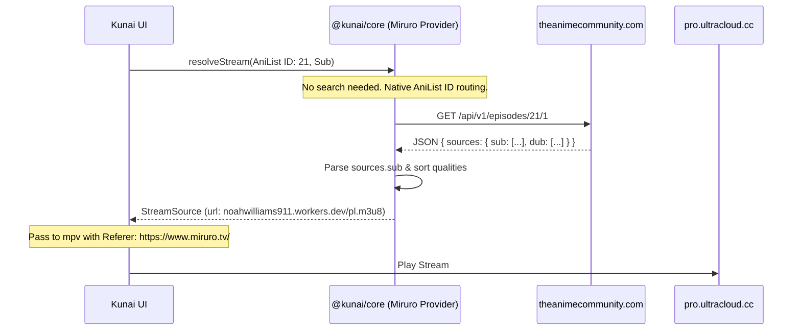
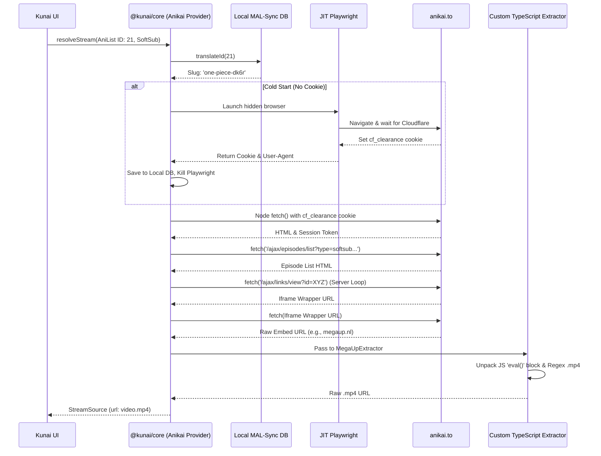
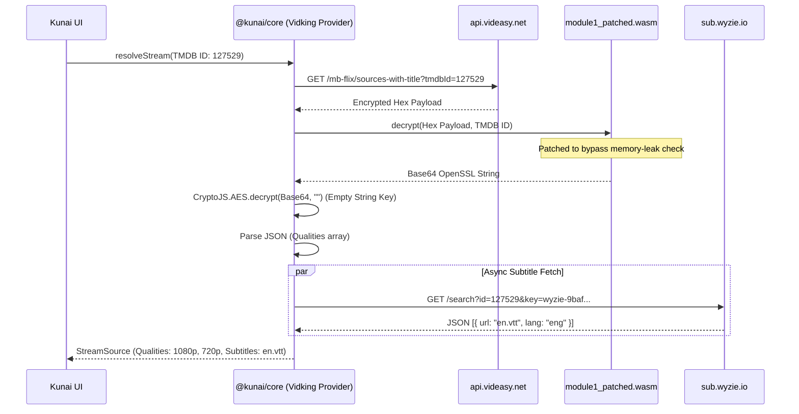
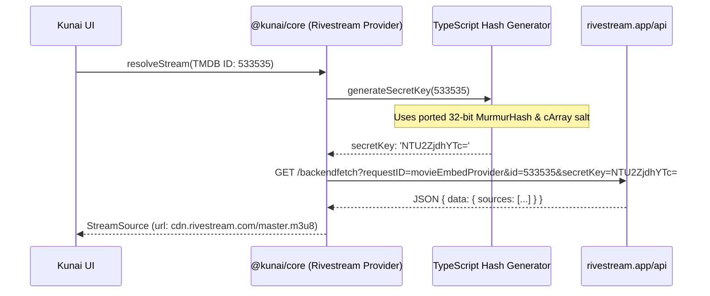
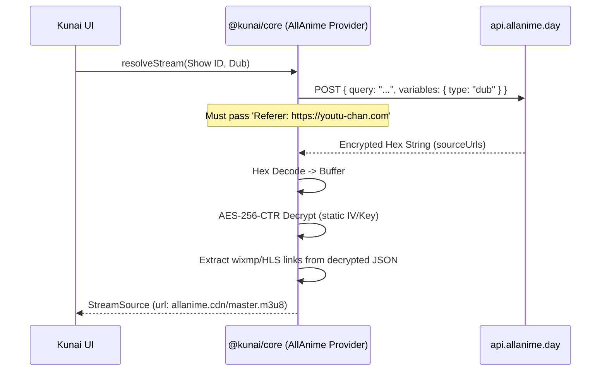

# Kunai Provider Extraction Flows (Mermaid Diagrams) 🥷✨

This document provides visual, deterministic state machines for how `@kunai/scraper-core` extracts streams from each of our supported providers. It serves as a visual companion to the textual dossiers.

---

## 1. Miruro (0-RAM Backend Bypass)
**Strategy:** Pure Node.js `fetch()` directly to the hidden backend, bypassing the Cloudflare-protected frontend entirely.

---

## 2. Anikai (Hybrid Harvest & Fetch)
**Strategy:** Use JIT Playwright *only once* to harvest the `cf_clearance` cookie, then use pure `fetch()` for all subsequent requests, injecting headless AJAX calls to bypass DOM clicking.

---

## 3. Vidking (WASM Bypass & Universal Decryptor)
**Strategy:** Pure 0-RAM Node.js. Bypass the browser entirely by loading the patched WebAssembly trap natively in Node, bypassing the decoy Hashids, and performing AES decryption.

---

## 4. Rivestream (0-RAM MurmurHash Generation)
**Strategy:** Pure 0-RAM Node.js. Generates the dynamic authentication hash locally in TypeScript to unlock the native JSON API.

---

## 5. AllAnime / AllManga (GraphQL & AES)
**Strategy:** Pure 0-RAM Node.js. Uses strict `Agent` spoofing to query the GraphQL API, hex decodes the payload, and applies an AES-256-CTR cipher.

