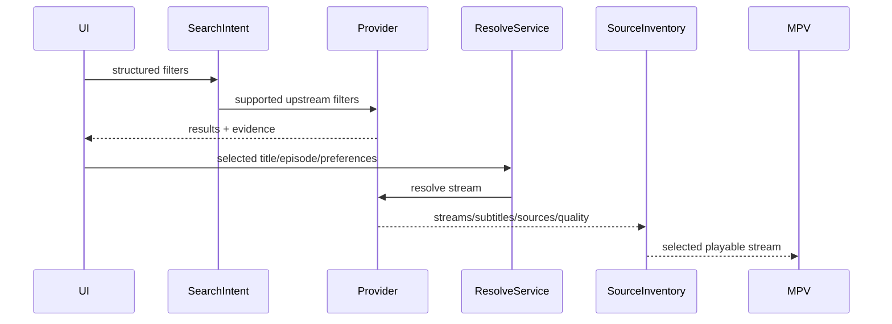

# Provider: AllManga (AllAnime)

## Summary

- **Media kinds:** Anime (Sub/Dub/Raw).
- **Search support:** Yes. GraphQL API (`shows` query).
- **Episode catalog support:** Yes. GraphQL API (`show` query + `episodeInfos` query).
- **Stream resolve support:** Yes. AES-256-CTR decryption of stream links. Server aggregation (UNI, YT, OK, Luf-Mp4, FM-HLS).
- **Language/audio/subtitle model:** First-class Sub/Dub/Raw split. Requested as `translationType` in GraphQL queries.
- **Server/source model:** True multi-server model. Different servers (e.g., UNI vs FM-HLS) require entirely different extraction strategies (e.g., WIXMP vs Filemoon AES).
- **Quality model:** Resolution parsed from master `.m3u8` or inferred from direct mp4 links.
- **Thumbnail/poster support:** Yes! Native `thumbnails` array and `uploadDates` available via hidden `episodeInfos` GQL query (Hash: `c8f3ac51...`). Seek-bar thumbnails supported natively by UNI servers via VTT sprites.
- **Known failure modes:** Referer validation failures (`tools.fast4speed.rsvp` required). Rate-limiting on GraphQL endpoints if queried concurrently without delays.

## User-Facing Capabilities

| Capability            | Supported | Evidence                   | Notes                                                                               |
| --------------------- | --------: | -------------------------- | ----------------------------------------------------------------------------------- |
| Search                |       yes | GQL `shows` query          | Direct API access. Stable.                                                          |
| Episode list          |       yes | GQL `episodeInfos`         | Extremely stable. Provides native thumbnails. Affects cache identity.               |
| Server switch         |       yes | Multiple nodes returned    | "UNI", "FM-HLS". User-visible.                                                      |
| Quality switch        |       yes | Manifest / JSON parsing    | User-visible.                                                                       |
| Audio language switch |       yes | `translationType` variable | _First-class dimension._ Dub/Sub require separate API calls. Affects cache heavily. |
| Soft subtitles        |       yes | Dependent on server        | UNI provides soft-subs. Affects UI.                                                 |
| Hardsubs              |       yes | Dependent on server        | YT/OK servers often hardsubbed.                                                     |
| Downloads             |       yes | Direct `.mp4` or `.m3u8`   | Highly reliable.                                                                    |

## Provider Data Shapes

- **Search result fields:** GQL `_id`, `name`, `thumbnail`, `availableEpisodesDetail`. Highly stable.
- **Episode fields:** GQL `episodeInfos` returns `thumbnails[]`, `uploadDates`, `notes`. Highly stable. Dictates cache identity.
- **Stream candidate fields:** Encrypted URL strings (`link`), `server` name. Origin: `episode-detail` query. Crucial for playback.
- **Subtitle fields:** Often embedded in the player `.m3u8`.
- **Thumbnail/artwork fields:** `thumbnails` array needs base URL prefixing (`https://wp.youtube-anime.com/...`).

## Flow

## Edge Cases

- **Empty result:** GQL returns empty `edges` array.
- **Region/block:** GQL returns Cloudflare 403.
- **Expired stream:** Direct `mp4` tokens expire rapidly.
- **Slow response:** Resolving `FM-HLS` requires executing a secondary Filemoon fetch + AES decrypt.
- **Missing subtitle:** Dub streams often omit subtitles.
- **Hardsub-only:** "YT" server provides hardsubbed 720p.
- **Multi-server duplicate:** Rare; servers are usually distinct architectures.
- **Language encoded in server name:** No. Language is defined by the `translationType` GQL variable.
- **Provider returns HTML in text:** WAF block on the GQL endpoint.
- **Provider returns non-playable upcoming episode:** Found natively via `broadcastInterval` tracking logic. UI correctly shows countdown instead of play button.

## Recommended Contract Changes

- **Needed fields:** `isEmbed` flag for iFrame-only servers. `countdownReleaseDate` for upcoming episodes.
- **Cache key dimensions:** `AllManga_[ShowID]_[Episode]_[TranslationType]`. `TranslationType` is mandatory.
- **Diagnostics events:** `GQLQuerySuccess`, `RefererValidationFailed`.
- **Tests to add:** Ensure `episodeInfos` parses the `thumbnails` array and prepends the correct base URL. Test Sub vs Dub query splitting.
