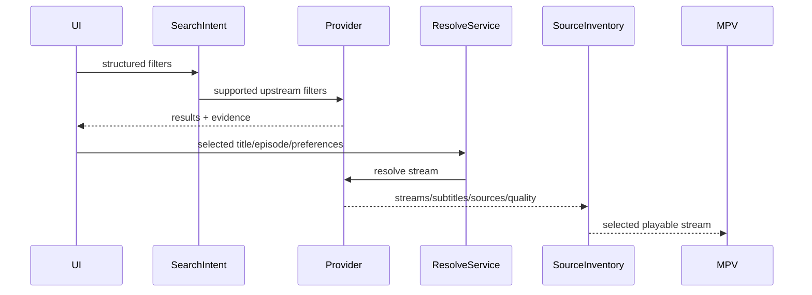

# Provider: Cineby

## Production status (2026-05-27)

- **Module:** `packages/providers/src/cineby/index.ts` — **research wrapper** over `resolveVidkingDirect` (not the default beta provider order).
- **Flavor table:** shared with VidKing via `listVidkingFlavors()`; Cineby **alias** names (Neon, Yoru, …) are diagnostics-only; playback inventory uses **One Piece** themed labels when the wrapper is used (same stable `source:vidking:videasy:{endpoint}` ids).
- **Selection:** one flavor per resolve from `preferredAudioLanguage` (movies-only flavors skipped on series).
- **Inherit:** Videasy timeouts, Phase A mirrors, and presentation contract from VidKing — do not maintain a separate decrypt stack.

## Summary

- **Media kinds:** Movies, TV Series.
- **Search support:** Yes, proxy to TMDB API.
- **Episode catalog support:** Yes, TMDB proxy.
- **Stream resolve support:** Yes — delegates to VidKing/Videasy (`packages/providers/src/vidking/direct.ts`).
- **Language/audio/subtitle model:** Flavor registry maps agent/endpoint + optional `languageQuery` / `filterQuality` (see `flavors.ts`).
- **Server/source model:** Cineby “agents” are **display aliases** for Videasy endpoints; Kunai **sources** use themed names (Luffy, Brook, …) when resolved through this wrapper.
- **Quality model:** Derived from the final `.m3u8` manifest.
- **Thumbnail/poster support:** Yes. TMDB proxies for episodes.
- **Known failure modes:** Upstream WAF changes to the "Agent" routes. If Cineby changes "killjoy" to another agent, the language routing breaks.

## User-Facing Capabilities

| Capability            | Supported | Evidence                                    | Notes                                                       |
| --------------------- | --------: | ------------------------------------------- | ----------------------------------------------------------- |
| Search                |       yes | TMDB passthrough                            | Highly stable, user-visible.                                |
| Episode list          |       yes | TMDB passthrough                            | Highly stable.                                              |
| Server switch         |       yes | Exposed as different stream options         | User-visible, but usually obfuscated behind "Auto" quality. |
| Quality switch        |       yes | HLS parsing                                 | Affects downloads and playback.                             |
| Audio language switch |       yes | Agent alias mapping                         | _Crucial._ `killjoy` = de. Affects Cache identity heavily.  |
| Soft subtitles        |       yes | Returned in standard payload                | User-visible.                                               |
| Hardsubs              |     maybe | Varies by source                            | Not reliably detectable until playback.                     |
| Downloads             |       yes | `yt-dlp` with optional `ffprobe` validation | Stable via `.m3u8` chunk harvesting.                        |

## Provider Data Shapes

- **Search result fields:** TMDB shapes.
- **Episode fields:** TMDB shapes.
- **Stream candidate fields:** JSON containing `url` (often encrypted), decrypted using local logic. Origin: Cineby proprietary endpoints.
- **Subtitle fields:** Standard VTT links.
- **Thumbnail/artwork fields:** TMDB proxies.

## Flow

## Edge Cases

- **Empty result:** Standard TMDB empty handling.
- **Region/block:** Cloudflare Turnstile blocks UI access if accessed outside the app.
- **Expired stream:** Short-lived tokens on `.m3u8` URLs. Cache TTL must be short (< 2 hours).
- **Slow response:** Agent routing can take 2-4 seconds.
- **Missing subtitle:** Normal fallback.
- **Hardsub-only:** Handled transparently by player.
- **Multi-server duplicate:** Common. `fade` and `viper` might return identical URLs.
- **Language encoded in server name:** The defining trait of Cineby. `killjoy` -> `de`. Engine must parse and normalize this to standard ISO codes before presenting to Shell.
- **Provider returns HTML in text:** Cloudflare WAF trigger.
- **Provider returns non-playable upcoming episode:** TMDB returns data, video endpoint returns 404.

## Recommended Contract Changes

- **Implemented:** Flavor → endpoint table in `packages/providers/src/vidking/flavors.ts` (`cinebyAlias` field for Neon / Yoru / …).
- **Cache key dimensions:** Follow VidKing cache policy; wrapper remaps `providerId` to `cineby` on the resolve result.
- **Diagnostics events:** WAF / timeout evidence same as VidKing.
- **Tests:** Wrapper inherits VidKing unit/live tests; dedicated Cineby matrix remains in `apps/experiments/scratchpads/provider-cineby/` (local notes gitignored).
- **Promotion:** Keep `status: research` in manifest until flavor matrix and WAF posture are validated outside lab network.
