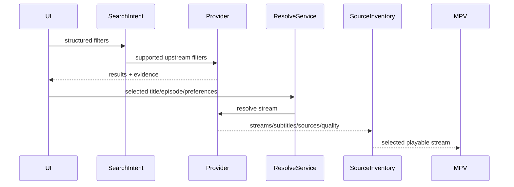

# Provider: Cineby

## Summary

- **Media kinds:** Movies, TV Series.
- **Search support:** Yes, proxy to TMDB API.
- **Episode catalog support:** Yes, TMDB proxy.
- **Stream resolve support:** Yes, heavily obfuscated Valorant agent aliases routing to VidKing core.
- **Language/audio/subtitle model:** Language is explicitly tied to the endpoint alias (e.g., `fade` = English, `killjoy` = German).
- **Server/source model:** "Agents" act as servers.
- **Quality model:** Derived from the final `.m3u8` manifest.
- **Thumbnail/poster support:** Yes. TMDB proxies for episodes.
- **Known failure modes:** Upstream WAF changes to the "Agent" routes. If Cineby changes "killjoy" to another agent, the language routing breaks.

## User-Facing Capabilities

| Capability            | Supported | Evidence                            | Notes                                                       |
| --------------------- | --------: | ----------------------------------- | ----------------------------------------------------------- |
| Search                |       yes | TMDB passthrough                    | Highly stable, user-visible.                                |
| Episode list          |       yes | TMDB passthrough                    | Highly stable.                                              |
| Server switch         |       yes | Exposed as different stream options | User-visible, but usually obfuscated behind "Auto" quality. |
| Quality switch        |       yes | HLS parsing                         | Affects downloads and playback.                             |
| Audio language switch |       yes | Agent alias mapping                 | _Crucial._ `killjoy` = de. Affects Cache identity heavily.  |
| Soft subtitles        |       yes | Returned in standard payload        | User-visible.                                               |
| Hardsubs              |     maybe | Varies by source                    | Not reliably detectable until playback.                     |
| Downloads             |       yes | `ffmpeg` / `yt-dlp`                 | Stable via `.m3u8` chunk harvesting.                        |

## Provider Data Shapes

- **Search result fields:** TMDB shapes.
- **Episode fields:** TMDB shapes.
- **Stream candidate fields:** JSON containing `url` (often encrypted), decrypted using local logic. Origin: Cineby proprietary endpoints.
- **Subtitle fields:** Standard VTT links.
- **Thumbnail/artwork fields:** TMDB proxies.

## Flow

## Edge Cases

- **Empty result:** Standard TMDB empty handling.
- **Region/block:** Cloudflare Turnstile blocks UI access if accessed outside the app.
- **Expired stream:** Short-lived tokens on `.m3u8` URLs. Cache TTL must be short (< 2 hours).
- **Slow response:** Agent routing can take 2-4 seconds.
- **Missing subtitle:** Normal fallback.
- **Hardsub-only:** Handled transparently by player.
- **Multi-server duplicate:** Common. `fade` and `viper` might return identical URLs.
- **Language encoded in server name:** The defining trait of Cineby. `killjoy` -> `de`. Engine must parse and normalize this to standard ISO codes before presenting to Shell.
- **Provider returns HTML in text:** Cloudflare WAF trigger.
- **Provider returns non-playable upcoming episode:** TMDB returns data, video endpoint returns 404.

## Recommended Contract Changes

- **Needed fields:** Internal lookup table mapping Agent aliases to ISO 639-1 languages.
- **Cache key dimensions:** `Cineby_[TMDB_ID]_[AgentAlias]`.
- **Diagnostics events:** WAF Trigger detection.
- **Tests to add:** Ensure `killjoy` endpoint payload results in `audioLanguage: "de"` in the `ProviderSourceInventory`.
