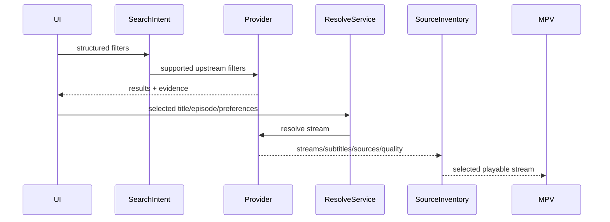

# Provider: Miruro

## Summary

- **Media kinds:** Anime.
- **Search support:** Yes, internal API + AniList.
- **Episode catalog support:** Yes, mapped via AniList IDs.
- **Stream resolve support:** Yes, via the proprietary "Pipe API" (XOR + Gzip encrypted payloads).
- **Language/audio/subtitle model:** Sub/Dub are distinct server pathways (`kiwi` vs `bee`).
- **Server/source model:** Animal-themed servers. `kiwi` (Hardsub, fast), `bee` (Softsub, slower but higher quality).
- **Quality model:** Standard parsed HLS.
- **Thumbnail/poster support:** Yes. Pipe API (`bee` server) explicitly returns a `thumbnails[]` array pointing to VTT sprites for the seek-bar. Main episode thumbnails require TMDB/AniList cross-reference.
- **Known failure modes:** Pipe API XOR key rotations. Heavy Cloudflare rate-limiting on stream resolve endpoints if called in rapid succession.

## User-Facing Capabilities

| Capability            | Supported | Evidence                       | Notes                                                                |
| --------------------- | --------: | ------------------------------ | -------------------------------------------------------------------- |
| Search                |       yes | AniList integration            | Highly stable. User-visible.                                         |
| Episode list          |       yes | AniList sync                   | Highly stable. Affects cache identity.                               |
| Server switch         |       yes | `kiwi`, `bee`                  | User-visible.                                                        |
| Quality switch        |       yes | HLS manifest                   | Standard parsing.                                                    |
| Audio language switch |       yes | Server selection dictates this | `kiwi` = sub, `bee` = sub/dub options depending on upstream payload. |
| Soft subtitles        |       yes | `bee` server                   | User-visible caption options.                                        |
| Hardsubs              |       yes | `kiwi` server                  | Permanent burn-in.                                                   |
| Downloads             |       yes | `ffmpeg`                       | Standard HLS downloads.                                              |

## Provider Data Shapes

- **Search result fields:** AniList canonical IDs and titles.
- **Episode fields:** AniList metadata.
- **Stream candidate fields:** XOR/Gzipped JSON payload containing `.m3u8` links, `thumbnails` (VTT), and `subtitles`. Origin: Pipe API.
- **Subtitle fields:** `url`, `lang` fields in the Pipe API response.
- **Thumbnail/artwork fields:** `thumbnails` array for seek-bar sprites. Main artwork via external DB.

## Flow

## Edge Cases

- **Empty result:** Standard API empty handling.
- **Region/block:** Heavy Cloudflare Turnstile implementation.
- **Expired stream:** XOR payload is dynamically generated per IP. High expiration rate.
- **Slow response:** Decrypting XOR + Gzip in JS can incur a 50-150ms penalty.
- **Missing subtitle:** Common on Dub tracks.
- **Hardsub-only:** If the user selects the `kiwi` server.
- **Multi-server duplicate:** No.
- **Language encoded in server name:** Indirectly. UI treats `kiwi`/`bee` as server names, but they inherently represent the subtitle/audio capability matrix.
- **Provider returns HTML in text:** WAF block on Pipe API.
- **Provider returns non-playable upcoming episode:** AniList integration provides next episode air dates.

## Recommended Contract Changes

- **Needed fields:** Decrypt keys tracked externally.
- **Cache key dimensions:** `Miruro_[AniListID]_[Episode]_[Server]`.
- **Diagnostics events:** `PipeAPIDecryptSuccess`, `PipeAPIDecryptFailed`.
- **Tests to add:** Validate XOR + Gzip unwrapping logic against a mocked payload to ensure `thumbnails[]` array is correctly populated.
