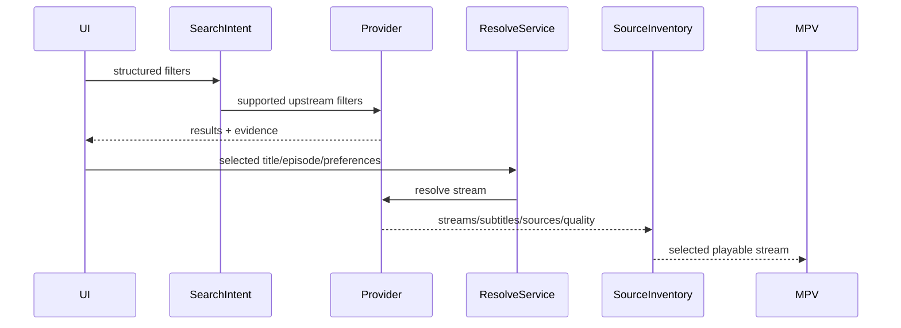

# Provider: Rivestream

## Summary

- **Media kinds:** Movies, TV Series.
- **Search support:** Yes. API based.
- **Episode catalog support:** Yes.
- **Stream resolve support:** Yes. Uses MurmurHash + a custom `cArray` salt to generate a `secretKey` for API authorization.
- **Language/audio/subtitle model:** Relies heavily on external service node names multiplexed with quality (e.g., `FlowCast (1080)`).
- **Server/source model:** Aggregator. Pulls from various underlying hosting providers.
- **Quality model:** Standard HLS and direct `.mp4`.
- **Thumbnail/poster support:** Yes. Backend fetch provides VTT/BIF files for the player seek-bar.
- **Known failure modes:** `cArray` salt rotation breaks the MurmurHash `secretKey` generation, resulting in 401 Unauthorized errors.

## User-Facing Capabilities

| Capability            | Supported | Evidence                                    | Notes                                                     |
| --------------------- | --------: | ------------------------------------------- | --------------------------------------------------------- |
| Search                |       yes | API                                         | Stable. User-visible.                                     |
| Episode list          |       yes | API                                         | Stable. Cache identity.                                   |
| Server switch         |       yes | Multiple upstream nodes                     | "FlowCast", etc. User-visible.                            |
| Quality switch        |       yes | String merged in source                     | `FlowCast (1080)`. Engine must regex/split this.          |
| Audio language switch |       yes | HLS manifest                                | MPV relies on standard HLS `#EXT-X-MEDIA` tags.           |
| Soft subtitles        |       yes | Sidecar or HLS                              | Reliable.                                                 |
| Hardsubs              |     maybe | Upstream dependent                          | Varies wildly.                                            |
| Downloads             |       yes | `yt-dlp` with optional `ffprobe` validation | Standard processing when a direct media URL is available. |

## Provider Data Shapes

- **Search result fields:** JSON array of canonical metadata.
- **Episode fields:** Basic episode objects.
- **Stream candidate fields:** Extracted from secured API endpoints. Contains stream URLs and subtitle tracks.
- **Subtitle fields:** `url`, `language`.
- **Thumbnail/artwork fields:** VTT/BIF sidecar URLs.

## Flow

## Edge Cases

- **Empty result:** Standard API handling.
- **Region/block:** Upstream API blocks.
- **Expired stream:** Tokenized stream URLs.
- **Slow response:** Upstream aggregator fetching can take 5+ seconds to resolve all sources.
- **Missing subtitle:** Normal fallback.
- **Hardsub-only:** Unpredictable based on upstream source.
- **Multi-server duplicate:** High probability. Aggregators often scrape the same underlying file hosts. Deduplication required.
- **Language encoded in server name:** Sometimes. E.g., `Server (Dub)`. Engine must parse and normalize.
- **Provider returns HTML in text:** WAF block.
- **Provider returns non-playable upcoming episode:** Usually omitted from the API payload entirely until aired.

## Recommended Contract Changes

- **Needed fields:** Regex parser rules to separate `serverLabel` from `quality` in merged strings.
- **Cache key dimensions:** `Rivestream_[MediaID]_[Episode]`.
- **Diagnostics events:** `HashGenerationFailed`, `API401Unauthorized`.
- **Tests to add:** Mock the MurmurHash + `cArray` logic to guarantee `secretKey` stability across Node versions.
