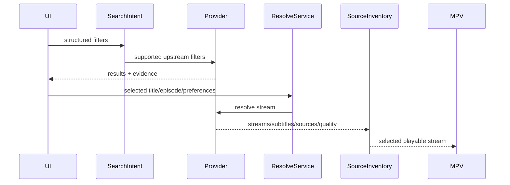

# Provider: Rivestream

> Agent-facing (L3). Never linked from published docs. Users: see `docs/users/`.

## Live capability audit (2026-11-27)

**Status: working after the adapter repair in this audit; upstream coverage is
still brittle.** The pre-repair run resolved 0/4 fixtures. Two independent
defects were measured: `cors.corsflix.net` reset or hung while its embedded
direct target answered HTTP 200, and valid nested playlists named
`*.m3u8.png` were not recognized as variant URIs. After unwrapping that
observed wrapper, preserving its declared playback headers, and parsing the
variant URI by `#EXT-X-STREAM-INF` position:

- Fixture coverage: Inception, Fight Club, Breaking Bad S01E01, Dutton Ranch
  S01E01.
- Result: 4/4 resolves succeeded and 4/4 independently probed selected streams
  were reachable. Fight Club produced a real 3840x2160 decode frame.
- Inventory: the cycle selected the first working backend, `Riven`, so the
  audit does not claim a full backend inventory. Movies measured 2160p; both
  series episodes measured 1080p. The Riven master advertised separate audio
  renditions but no ISO language metadata that the adapter could surface, and
  no subtitle sidecars were measured.
- Resolve latency after repair was 2.09-4.56 s.
- Actual media dependency: `norway-canary.bigbang.cymru` direct HLS. The API
  dependency remains `scrapper.rivestream.app`; `cors.corsflix.net` is treated
  as metadata carrying the direct target, not as the media path.

## Summary

- **Media kinds:** Movies, TV Series.
- **Search support:** No in the production contract. The scraper backend has metadata endpoints, but the production adapter is TMDB-keyed and resolver-only.
- **Episode catalog support:** No in the production contract; season/episode coordinates come from the TMDB lane.
- **Stream resolve support:** Yes. Uses MurmurHash + a custom `cArray` salt to generate a `secretKey` for API authorization.
- **Language/audio/subtitle model:** Relies heavily on external service node names multiplexed with quality (e.g., `FlowCast (1080)`).
- **Server/source model:** Aggregator. Pulls from various underlying hosting providers.
- **Quality model:** Standard HLS and direct `.mp4`.
- **Thumbnail/poster support:** Yes. Backend fetch provides VTT/BIF files for the player seek-bar.
- **Known failure modes:** `cArray` salt rotation breaks the MurmurHash `secretKey` generation, resulting in 401 Unauthorized errors.
- **Demoted backends (2026-10-14):** `savannah`, `prometheus`, `quasar`, and `solstice` return no sources for titles other mirrors serve. (`primevids` answered 403 on 2026-10-14 and returned sources again on 2026-11-12, so it is no longer demoted.) They trail the service cycle as a last resort (`RIVESTREAM_DEMOTED_BACKENDS`) and are skipped by prefetch — the cycle stops at the first working mirror (e.g. citadel) without spending an attempt on them. Nothing is dropped: a recovered backend still resolves when everything ahead fails.

## User-Facing Capabilities

| Capability            | Supported | Evidence                                    | Notes                                                     |
| --------------------- | --------: | ------------------------------------------- | --------------------------------------------------------- |
| Search                |        no | not in production contract                  | TMDB lane owns search.                                    |
| Episode list          |        no | not in production contract                  | TMDB lane owns season/episode identity.                   |
| Server switch         |       yes | Multiple upstream nodes                     | "FlowCast", etc. User-visible.                            |
| Quality switch        |       yes | String merged in source                     | `FlowCast (1080)`. Engine must regex/split this.          |
| Audio language switch |       yes | HLS manifest                                | MPV relies on standard HLS `#EXT-X-MEDIA` tags.           |
| Soft subtitles        |       yes | Sidecar or HLS                              | Reliable.                                                 |
| Hardsubs              |     maybe | Upstream dependent                          | Varies wildly.                                            |
| Downloads             |       yes | `yt-dlp` with optional `ffprobe` validation | Standard processing when a direct media URL is available. |

## Provider Data Shapes

- **Search result fields:** JSON array of canonical metadata.
- **Episode fields:** Basic episode objects.
- **Stream candidate fields:** Extracted from secured API endpoints. Contains stream URLs and subtitle tracks.
- **Subtitle fields:** `url`, `language`.
- **Thumbnail/artwork fields:** VTT/BIF sidecar URLs.

## Flow

```mermaid
sequenceDiagram
  participant UI
  participant SearchIntent
  participant Provider
  participant ResolveService
  participant SourceInventory
  participant MPV

  UI->>SearchIntent: structured filters
  SearchIntent->>Provider: supported upstream filters
  Provider-->>UI: results + evidence
  UI->>ResolveService: selected title/episode/preferences
  ResolveService->>Provider: resolve stream
  Provider-->>SourceInventory: streams/subtitles/sources/quality
  SourceInventory-->>MPV: selected playable stream
```

## Edge Cases

- **Empty result:** Standard API handling.
- **Region/block:** Upstream API blocks.
- **Expired stream:** Tokenized stream URLs.
- **Slow response:** Upstream aggregator fetching can take 5+ seconds to resolve all sources.
- **Missing subtitle:** Normal fallback.
- **Hardsub-only:** Unpredictable based on upstream source.
- **Multi-server duplicate:** High probability. Aggregators often scrape the same underlying file hosts. Deduplication required.
- **Language encoded in server name:** Sometimes. E.g., `Server (Dub)`. Engine must parse and normalize.
- **Provider returns HTML in text:** WAF block.
- **Provider returns non-playable upcoming episode:** Usually omitted from the API payload entirely until aired.

## Recommended Contract Changes

- **Needed fields:** Regex parser rules to separate `serverLabel` from `quality` in merged strings.
- **Cache key dimensions:** `Rivestream_[MediaID]_[Episode]`.
- **Diagnostics events:** `HashGenerationFailed`, `API401Unauthorized`.
- **Tests to add:** Mock the MurmurHash + `cArray` logic to guarantee `secretKey` stability across Node versions.

## Header and rendition inventory recovery (2026-10-24)

HLS expansion uses the same request headers as the candidate gate and playback
handoff. Observed HLS masters retain subtitle renditions and audio languages;
separate-audio masters remain one Auto URL to preserve sound. Extensionless HLS
media keeps its observed protocol. A source switch promotes `preferredSourceId`
and resolves that source's own quality rows rather than relabeling the winning
source's URLs. Untried sources remain inventory candidates, not proven qualities.

Query-string headers are accepted only on the exact HTTPS
`proxy.valhallastream.com/m3u8` wrapper with no credentials or nondefault port.
The JSON declaration is capped at 8192 characters; only Referer, Origin and
User-Agent survive, with bounded values and no control bytes. Host, connection
and credential overrides are rejected; unrelated hosts cannot declare headers.
(Superseded 2026-11-27: `cors.corsflix.net/m3u8?url=` is now unwrapped to its
HTTPS target, and that host may declare the same bounded headers; see the live
audit section.) The normal stream target guard still checks all fetched
manifests, redirects and probe destinations.

A bounded isolated TMDB 550 movie resolve returned the 720/480 HLS source with
26 subtitles. The API also returned Vanguard's 4K HDR wrapper. A separate guarded
direct-target request returned HTTP 502, disproving an assumption that bypassing
the wrapper was a qualified fix on this host. Do not turn either refusal into
playability evidence. No decoded-frame playback qualification was performed.
