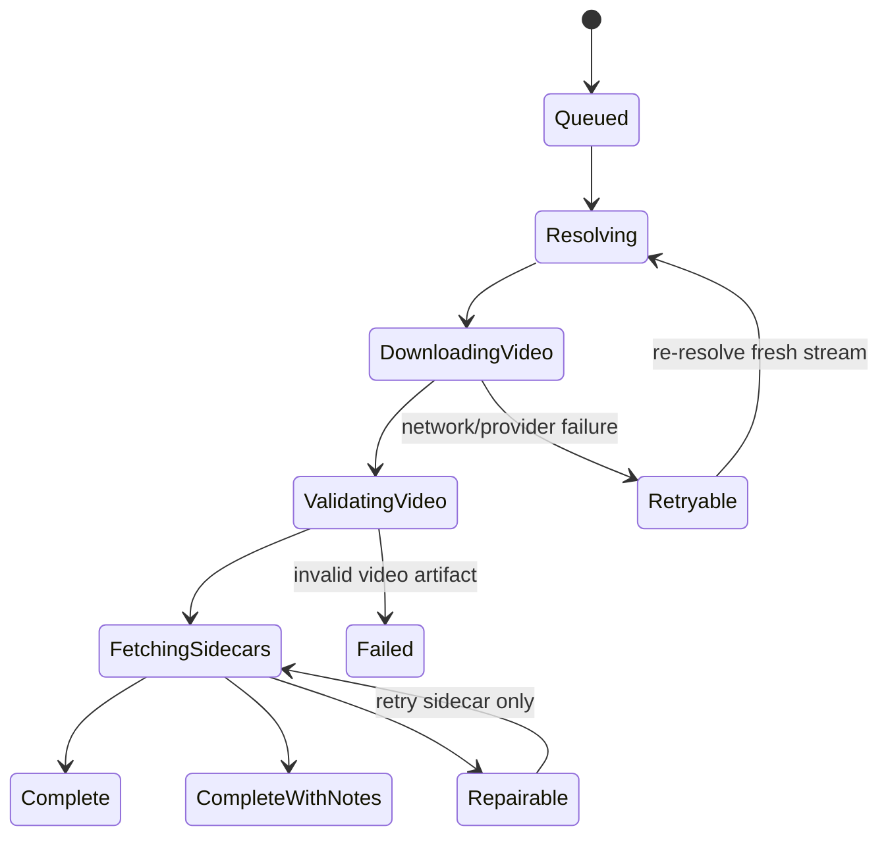

# Provider Usage Matrix

This document normalizes and compares behavior across all KitsuneSnipe provider engines to guide the Architecture V2 implementation.

## Elite Findings & Strategic Adjustments

- **Seek-bar Thumbnails:** Natively supported via `#EXT-X-IMAGE-STREAM-INF` (VidKing/Cineby), direct GQL `episodeInfos.thumbnails[]` (AllManga), and Pipe API VTT sprites (Miruro). These _must_ be mapped directly to MPV `--demuxer-mkv-subtitle-preroll` or handled via the TUI without extra network calls.
- **Release Schedule Reconciliation:** AllManga's `broadcastInterval` + `uploadDates` logic supersedes the need for AniList reconciliation for Anime.
- **ISO Language Normalization:** The shell strictly uses ISO 639-1 (e.g., `de`, `en`, `ja`). Engines are responsible for translating this into their specific backend quirks (Cineby's `killjoy`, AllManga's `translationType="sub"`, VidKing's `quality="Hindi"`).
- **State Handover:** When the user switches languages in the UI, if the provider treats Sub/Dub as separate episodes (e.g., AllManga), the Shell MUST restart the stream and pass `--start={currentTime}` to MPV to resume playback seamlessly.

## Feature Matrix

| Provider       | Mode         | Search | Catalog | Sources     | Quality | Audio          | Soft Subs | Hardsub | Downloads | Notes                                                            |
| -------------- | ------------ | ------ | ------- | ----------- | ------- | -------------- | --------- | ------- | --------- | ---------------------------------------------------------------- |
| **VidKing**    | series/movie | yes    | yes     | server-like | yes     | server-derived | yes       | maybe   | yes       | Language often hidden in `quality` string.                       |
| **Cineby**     | series/movie | yes    | yes     | server      | yes     | server-derived | yes       | maybe   | yes       | Valorant agent aliases (`killjoy`=de) dictate audio.             |
| **AllManga**   | anime        | yes    | yes     | server      | yes     | sub/dub split  | yes       | yes     | yes       | `translationType` is a first-class dimension. Native thumbnails. |
| **Miruro**     | anime        | yes    | yes     | server      | yes     | sub/dub split  | yes       | yes     | yes       | `bee` (softsub) vs `kiwi` (hardsub). XOR API.                    |
| **Rivestream** | series/movie | yes    | yes     | server      | yes     | manifest       | yes       | maybe   | yes       | Source/Quality merged in strings (`FlowCast (1080)`).            |

---

## Normalized Source Inventory Recommendation

To ensure uniform cache identities and UI parity across all these disparate systems, the following TypeScript contract must be enforced for all `resolve()` returns.

```ts
type ProviderSourceInventory = {
  streams: Array<{
    id: string; // Hash of sourceId + quality + audioLanguage
    sourceId?: string; // The original provider server (e.g., "UNI", "FM-HLS")
    serverLabel?: string; // Cleaned UI label (e.g., "Filemoon")
    quality?: string; // Parsed out from merged strings, e.g., "1080p", "720p", "Auto"
    audioLanguage?: string; // STRICTLY ISO 639-1 code (e.g., "ja", "en", "de")
    subtitleMode?: "soft" | "hard" | "none" | "unknown";
    subtitleLanguage?: string; // Only applicable if hardsubbed, otherwise track via `subtitles`
    isEmbed?: boolean; // True if the stream is an iframe instead of an mp4/m3u8
    headers?: Record<string, string>; // Crucial for Origin/Referer bypasses
  }>;
  subtitles: Array<{
    id: string;
    language: string; // ISO 639-1
    format?: string; // "vtt", "ass", "srt"
    url?: string;
    embedded?: boolean; // True if multiplexed into the m3u8 stream
    forced?: boolean;
  }>;
  artwork?: {
    posterUrl?: string;
    thumbnailUrl?: string;
    backdropUrl?: string;
    seekBarVttUrl?: string; // Direct link to thumbnail sprite map
  };
};
```

---

## Download Recovery State Diagram

Downloads must use the exact same normalized `ProviderSourceInventory` as playback, preventing duplicated logic or misaligned cache keys.


