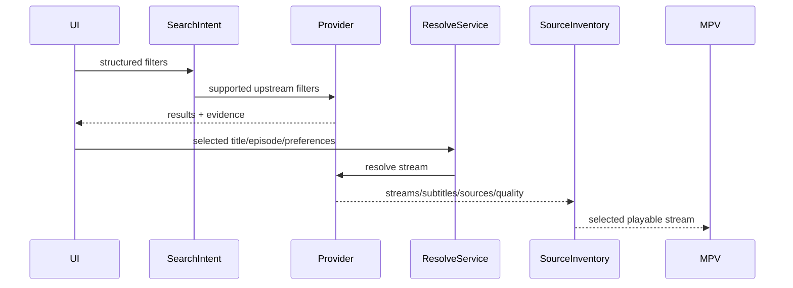

# Provider: Videasy

## Production status (2026-07-16)

- **Module:** `packages/providers/src/videasy/direct.ts` + `flavors.ts` + `crypto.ts`
- **Active stream API:** `api.speedracelight.com` (primary; used by player.videasy.to / cineby.at / cineplay.to). Mirror: `api.wingsdatabase.com`.
- **Decrypt:** seed + `enc=2` + mvm1 PRNG XOR. **Must use sparse `Array(61)`** for PRNG state (`n in state` mask). Dense arrays break every payload.
- **Cineby UI catalog** (https://www.cineby.at/tv/299167 “Dutton Ranch” example):
  | UI             | API route                  | Live note (S1E1)         |
  | -------------- | -------------------------- | ------------------------ |
  | Yoru           | `/cdn`                     | often empty on TV        |
  | Neon           | `/neon2`                   | **works** (HLS+DASH)     |
  | Sage           | `/ym`                      | title-dependent          |
  | Jett           | `/jett`                    | title-dependent          |
  | Breach         | `/m4uhd`                   | often 403                |
  | Vyse           | `/hdmovie` quality=English | title-dependent          |
  | Killjoy        | `/meine` language=german   | **works** with imdbId    |
  | Fade           | `/hdmovie` quality=Hindi   | title-dependent          |
  | Omen           | `/lamovie`                 | **works**                |
  | Raze           | `/superflix`               | needs full params        |
  | Cypher (Kunai) | `/downloader2`             | **works** quality ladder |
- **Inventory order:** matches Cineby Servers UI — Yoru → Neon → Sage → Jett → Breach → Vyse → Killjoy → Fade → Omen → Raze; **Cypher** is Kunai-only after the catalog (not shown on the website).
- **Resolve order:** Phase A is Yoru → Cypher → Neon → Sage → Jett → Breach → Vyse; localized Killjoy/Fade/Omen/Raze stay Phase B / lazy.
- **Legacy:** `api.videasy.to/{server}/sources-with-title` still **404**.
- **Fixtures:** Study Group `233347` S1E2; Dutton Ranch `299167` S1E1; crypto golden under `packages/providers/test/fixtures/videasy/wings-enc2-neon2.json`.
- **Redaction:** do not store signed HLS URLs, cookies, or session tokens in this dossier.

## Production status (2026-07-11) — historical

- **Live matrix:** **fail** at the time — `api.videasy.to` stream routes 404; wings/speedracelight path not yet wired with working decrypt.
- **Disposition then:** demote from series default + quarantine dead `api.videasy.to` endpoints.
- **Superseded by 2026-07-16** repair of crypto + host + Cineby catalog mapping.

## Production status (2026-05-27) — historical

- **Videasy fetch timeout:** **90s** per server attempt; engine `attemptTimeoutMs` aligned (~300s cap for full cycle).
- **Default resolve (Phase A):** up to **3** English mirrors in order — **Luffy** (`mb-flix`) → **Zoro** (`cdn`) → **Nami** (`downloader2`); no 4+4 embed fanout on the default path.
- **Phase B (lazy):** remaining English flavors + preferred audio language (e.g. Brook / German) probed in background via `VideasyLazySourceProbeService`; inventory merges without blocking first play.
- **Source presentation:** providers emit `source.label` (themed name), `metadata.flavorArchetype` (subtitle), stable `source:videasy:videasy:{endpoint}` ids — shell does not map endpoints.
- **Title health:** advisory only; does not reorder resolve (see `.docs/title-provider-health-and-cache-reset.md`).
- **Query parity:** `tmdbId`, season/episode, `year`, `imdbId`, `_t` on Videasy requests.
- **Preferred source fallback:** when a pinned flavor fails, resolve falls back to Phase A mirrors before embed-referer retry.
- **Endpoint quarantine:** deprecated routes (`1movies`/Sanji) are seeded into shared `endpointHealth`; HTTP 404/410 and persistent 5xx are quarantined at runtime (persisted in cache DB). Preferred pins on quarantined endpoints are cleared automatically.

## Summary

- **Media kinds:** Movies, TV Series.
- **Search support:** Yes, proxy to TMDB API.
- **Episode catalog support:** Yes, proxy to TMDB (`/tv/{id}/season/{s}`).
- **Stream resolve support:** Yes, via AES-encrypted payloads decrypted via WASM.
- **Language/audio/subtitle model:** Variable. Often relies on server-derived language aliases (e.g., passing `?language=german`) or multiplexes audio into the `quality` field (`English`, `Hindi`).
- **Server/source model:** Videasy **endpoints** (`mb-flix`, `cdn`, …) exposed in UI as themed **sources** (Luffy, Zoro, …). Same endpoint → same label and `sourceId` on every episode.
- **Quality model:** Standard (1080p, 720p). Muxed in the `.m3u8` manifest or passed directly as stream metadata.
- **Thumbnail/poster support:** Yes. Episode thumbnails via TMDB `still_path`. Seek-bar thumbnails natively available in `#EXT-X-IMAGE-STREAM-INF` within the resolved HLS manifest.
- **Legacy alias:** `vidking` remains accepted as a config/cache/provider-id alias for this provider.
- **Known failure modes (2026-07-11 primary):** stream API route-dead (`sources-with-title` HTTP 404). Historical: slow responses (>12s false timeouts — now 90s), empty WASM keys, TMDB rate-limiting, HLS image-stream gaps, shared endpoints needing `languageQuery` / `filterQuality`.

## User-Facing Capabilities

| Capability            | Supported | Evidence                                    | Notes                                                                         |
| --------------------- | --------: | ------------------------------------------- | ----------------------------------------------------------------------------- |
| Search                |       yes | `search/multi` TMDB proxy endpoint          | Data originates from TMDB proxy. High stability. User-visible.                |
| Episode list          |       yes | `/tv/{id}/season/{s}` TMDB proxy            | High stability. Affects cache identity (season-level).                        |
| Server switch         |       yes | Returns multiple provider nodes             | Nodes often correlate to audio language. User-visible in player settings.     |
| Quality switch        |       yes | Manifest parsing (`EXT-X-STREAM-INF`)       | Resolution parsed from HLS. Stable. Used for playback/downloads.              |
| Audio language switch |       yes | `?language=` endpoint or `quality` string   | Varies by sub-architecture (Meine vs HDMovie). Affects stream cache identity. |
| Soft subtitles        |       yes | Native HLS `EXT-X-MEDIA:TYPE=SUBTITLES`     | Stable. Affects user-visible caption menus.                                   |
| Hardsubs              |     maybe | Embedded in video stream                    | Usually defaults to soft-subs, but specific older sources may bake them in.   |
| Downloads             |       yes | `yt-dlp` with optional `ffprobe` validation | Reliable. Requires downloading HLS chunks and sidecar VTTs separately.        |

## Provider Data Shapes

- **Search result fields:** Standard TMDB response (`id`, `title`, `poster_path`, `media_type`). Sourced directly from TMDB; highly stable. User-visible.
- **Episode fields:** TMDB season payload (`episode_number`, `name`, `still_path`, `overview`). Stable. Cache impact: cache by Series ID + Season.
- **Stream candidate fields:** `sources` array containing `url`, `quality` (often abused for language like "Hindi"), `type` ("hls"). Originates from WASM decrypt. Crucial for playback and cache identity.
- **Subtitle fields:** `tracks` array containing `file` (URL), `label` (Language), `kind` ("captions"). Originates from API response or `.m3u8`. User-visible in player.
- **Thumbnail/artwork fields:** `poster_path` and `backdrop_path` for main UI. `still_path` for episode rows. `#EXT-X-IMAGE-STREAM-INF` for seek-bar sprites.

## Flow

## Edge Cases

- **Empty result:** TMDB proxy returns 200 OK with `results: []`. Shell should display generic empty state.
- **Region/block:** Cloudflare 403 on the resolving endpoint. Handled by fallback to alternate provider.
- **Expired stream:** The `.m3u8` token expires (usually ~2-6 hours). Re-resolve needed. Affects Cache TTL.
- **Slow response:** WASM execution can be slow on low-end devices. Should not block UI mounting (Deferred Locators).
- **Missing subtitle:** Empty `tracks` array or missing `SUBTITLES` in HLS. UI must hide subtitle button.
- **Hardsub-only:** Detected when video stream is provided but `tracks` is empty. No UI flag needed, just absence of options.
- **Multi-server duplicate:** Multiple servers return the exact same source URL. Shell deduplicates by hashing the `url`.
- **Language encoded in server name:** "Meine" endpoints rely on ISO codes. HDMovie uses strings like `quality: "Hindi"`. Shell must map string matching to `audioLanguage`.
- **Provider returns HTML in text:** WAF blocks return 200 OK with Cloudflare HTML challenge. Detected by JSON parse failure -> trigger retry/fallback.
- **Provider returns non-playable upcoming episode:** TMDB returns episode data, but VidKing WASM API returns 404/Empty. UI marks as "Not yet aired".

## Recommended Contract Changes

- **Implemented:** Themed `label` + `metadata.flavorArchetype` on `ProviderSourceCandidate`; `flavorLabel` / `serverName` on `StreamCandidate`; registry in `flavors.ts`.
- **Still open:** Explicit `seekBarVTT` from HLS `#EXT-X-IMAGE-STREAM-INF` in direct resolver (dossier previously claimed this; not wired in `direct.ts` yet).
- **Cache key dimensions:** `[Provider]_[MediaID]_[Season]_[Episode]_[ISO_Language]`. Language MUST be in the key.
- **Diagnostics events:** `WASMLoadStart`, `WASMDecryptSuccess`, `WASMDecryptFailed` (trace events exist; expand if needed).
- **Tests:** `packages/providers/test/vidking-flavors.test.ts`, `vidking-bloodhounds` live smoke.
- **Lab:** `apps/experiments/scratchpads/provider-cineby/` for endpoint discovery; transient `CINEBY_*.md` notes are gitignored after 2026-05-27 reconciliation.
