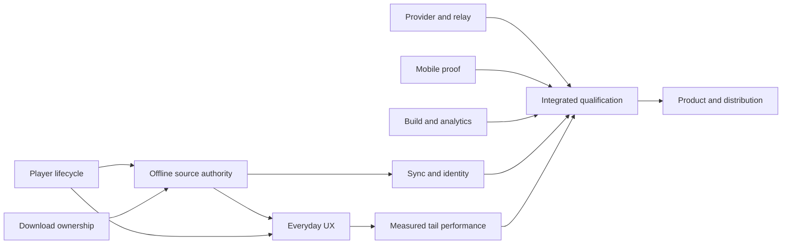

# Kunai reliability, performance and growth execution runbook

Status: FIXES IN OPEN PRS; reconcile assignments through the [PR review](./2026-10-01-pr-review.md) before implementing residue.
Written 2026-10-01 against `fix/resolve-gate-coverage@e5fd018af3d673d9dc10e866dabbf4428486ddb1`.
The [roadmap](./roadmap.md) is the only status/assignment index. This file defines execution policy and dependencies, not a second issue board.

## Objective and brief

User request: give other agents concrete plans to repair the audit's bugs, improve tail performance and production practices, and make Kunai useful enough that users retain and recommend it. Deliver reliable CLI playback and offline continuity first; improve mobile within demonstrated platform capabilities; build distribution around verified experiences. Virality is an outcome to test, not an engineering guarantee.

Scope comes from the [audit](./2026-09-30-codebase-audit.md), its download supplement, AGENTS.md and current subsystem contracts. Success means every confirmed finding has current evidence of remediation, every affected journey has integration/external qualification, and performance/product claims have stated sample populations and denominators. “All bugs solved” is never an acceptance claim.

## Reconciliation before assignment

- Gate omission A09 was repaired in 9c49453f0; e5fd018af additionally rejects an empty parsed production roster. Strengthen behavioral coverage and qualify live behavior; do not redo the gate insertion.
- The 1 ms guarded-fetch DNS budget in A01 was repaired by e5999a22a. Preserve its timeoutMs contract and regression. AniDB's HLS text wrapper still discards request policy and omits local lookup; that is R01's remaining implementation.
- Provider DNS pinning landed in a1849a389; qualify TLS authority, redirects, relay ownership and actual HTTPS before a release claim.
- User reported `bun audit --json` output `{}` on September 30. No exit status/lockfile fingerprint was supplied. Treat this as an empty user-reported advisory result, not proof about future installs or every attack surface. Reconcile existing plan 063 before upgrades.
- Original 484 shared-package, 920 provider, 332 download/offline and other focused passes are historical snapshots. They are not the executor's fresh green gate.
- Existing plans 022, 032, 044, 045, 060, 008, 010–015, 063, 065 and mobile/provider-independent/boundary plans remain owners of their stated subjects. The packets below specify current audit deltas and acceptance; do not execute stale duplicate 048–058 drafts.

## Work packets and dependencies

| Packet                                             | Findings / outcome                                                  | Prerequisite                                           | Exclusive seam                                                         |
| -------------------------------------------------- | ------------------------------------------------------------------- | ------------------------------------------------------ | ---------------------------------------------------------------------- |
| [R01](./2026-10-01-r01-provider-transport.md)      | A01/A07/A08/A09/A12/A13; guarded provider and relay behavior        | baseline refresh                                       | providers, relay, relay-server, shared fetch contract                  |
| [R02](./2026-10-01-r02-playback-lifecycle.md)      | A02/A03; buffering and generation-safe recovery                     | baseline refresh                                       | desktop player/watchdog                                                |
| [R03](./2026-10-01-r03-download-durability.md)     | A04/A20/A21/A22; queue ownership and artifact lifecycle             | migration reservation                                  | download service/repository                                            |
| [R04](./2026-10-01-r04-offline-authority.md)       | A18/A19 and existing provider-independence plan                     | R03 repository contract; R02 lifecycle                 | PlaybackPhase, offline selection/library/query                         |
| [R05](./2026-10-01-r05-account-and-persistence.md) | A05/A06/A11, 044/045; auth/sync/config/identity                     | R03/R04 storage freeze                                 | sync outbox/account/config and reference migration                     |
| [R06](./2026-10-01-r06-mobile-qualification.md)    | A10; repeated state failures and physical host qualification        | independent; R05 before future shared config           | mobile application/runtime only                                        |
| [R07](./2026-10-01-r07-build-and-analytics.md)     | A14/A15/A17; build truth, CI, privacy-consistent aggregates         | analytics metric decision for its implementation       | docs generation/Turbo/CI/ingest                                        |
| [R08](./2026-10-01-r08-everyday-ux.md)             | A16/022; focus, mutation feedback, preservation and continuity      | R02/R03/R04 outcomes                                   | shell input/workflows/settings                                         |
| [R09](./2026-10-01-r09-tail-performance.md)        | 060/008; measured startup/interaction/resolve/recovery/space bounds | baseline capture can start now; optimize after R01–R08 | instrumentation/benchmark contracts; each runtime owner fixes its path |
| [R10](./2026-10-01-r10-product-and-growth.md)      | activation, retention, share/install/docs/contributors              | R07 docs contracts, R08 journey, R09 qualification     | user docs/share fallback/demo and growth evidence                      |



Recommended first assignments are R01, R02, R03 and R06 in isolated worktrees. With fewer workers, retain this priority order. R07's independent build/CI task may run when a slot frees; analytics semantics are a separate decision gate. R09 may capture the baseline early without editing others' runtime files.

## Shared-file ownership and integration

One coordinator owns root manifests/lockfile/Turbo, shared exported types, migration IDs, container composition, roadmap statuses and integration. Packet owners propose these changes in their isolated branch; coordinator approves the precise contract and integrates in dependency order. No two agents edit the same shared checkout.

- Reserve migration IDs from the current `dataMigrations` list at execution, not from this report's date. R03 owns download claim migration first; R04 indexed offline query changes follow; R05 owns outbox/identity migrations afterward. Never edit an already released migration in place.
- R02 owns PersistentMpvSession and player outcomes. R04 owns PlaybackPhase's local/provider authority. R08 consumes their outcomes; it must not patch player or storage implementations.
- R03 defines deletion/cleanup results. R04 and R08 update callers only after that result contract is accepted. Do not independently design different deletion enums.
- R01 owns any ProviderFetchPort amendment. Prefer the existing resolvesLocally contract and timeoutMs; an exported change requires every production adapter/relay consumer decision.
- R07 owns generated docs/build inputs. R10 consumes those contracts and does not edit generator ownership in parallel.
- An assignment records packet/task IDs, immutable base SHA, allowed paths, reserved contracts, dependencies, terminal/platform constraints and expected evidence. Rebase/refresh once prerequisites land; resolve conflicts by reading behavior, not choosing one side mechanically.

## Standard executor procedure

1. Read AGENTS.md, feature map, packet, owning docs and tests. Record `git rev-parse HEAD`, branch, worktree and pre-existing diff. Compare with the assignment base.
2. Try to disprove each finding. If current code already meets acceptance, run that regression and record “already addressed at SHA”; do not manufacture a change.
3. Add the named failing behavior scenario using real temp repositories and controlled promises/clocks. Preserve evidence of the failure.
4. Implement the smallest complete change, including consumers, reverse/readback actions and owning doc. No unrelated extraction or dependency upgrade.
5. Run focused regressions, affected package gates, then integrated gates at the final SHA. A reviewer traces callers and attempts to break the fix.
6. Publish a reviewable diff/evidence report. Commit, merge, issue/comment publication, account mutation, deployment and release remain subject to explicit session authorization. This handoff does not authorize them.

No blanket new approval is needed for authorized local implementation/tests. The coordinator should resolve routine design details from the contracts. Product/privacy choices that change retention, analytics disclosure or automatic destructive behavior require a concrete user decision.

## Storage-safe commands

For interactive developer runs, create a private sandbox and pass it explicitly:

```sh
task_sandbox=$(mktemp -d /tmp/kunai-agent-XXXXXX)
SANDBOX_DIR="$task_sandbox" KEEP=1 bun run sandbox -- --offline
```

For scripts/root tests use the full platform-resolved environment, or the existing test storageRootEnv helper. Keep credentials out of commands and logs:

```sh
task_profile=$(mktemp -d /tmp/kunai-checks-XXXXXX)
export HOME="$task_profile" USERPROFILE="$task_profile"
export XDG_CONFIG_HOME="$task_profile/config" XDG_DATA_HOME="$task_profile/data"
export XDG_CACHE_HOME="$task_profile/cache" XDG_STATE_HOME="$task_profile/state"
export XDG_RUNTIME_DIR="$task_profile/runtime"
export APPDATA="$task_profile/appdata" LOCALAPPDATA="$task_profile/localappdata"
bun run typecheck -- --force
bun run lint -- --force
bun run fmt:check
bun run test -- --force
bun run verify:doc-paths
bun run verify:doc-frontmatter
bun run verify:parity-references
bun run build -- --force
bun run pkg:check
```

Run these from the assigned checkout in a disposable shell. Never use KUNAI_CONFIG_DIR. Shadow copies of real data flow inward only; redact artifacts before sharing. Format only owned changed files during implementation, then use fmt:check globally. verify:doc-coverage is hosted-only; a local skip is not coverage proof. Actual platform skip counts belong in the report.

A complete feature needs build qualification. Docs changes additionally need a cold/warm docs build and generator freshness; mobile needs its package build and graph gates. Network/socket restrictions are environment limits: preserve the failure and complete unaffected checks, then qualify on an authorized capable runner.

## Evidence and closure contract

Every task returns this block:

```json
{
  "packet": "R03",
  "tasks": ["R03.1"],
  "baseSha": "assignment base SHA",
  "testedSha": "final candidate SHA",
  "findings": ["A21"],
  "changedPaths": [],
  "redScenarios": [],
  "focusedChecks": [],
  "integratedChecks": [],
  "externalChecks": [],
  "skippedChecks": [],
  "remainingRisks": []
}
```

Arrays contain exact commands, exit codes, relevant counts, artifacts and scope. testedSha must be a real commit when an authorized commit exists; for uncommitted candidates include HEAD plus the diff hash, never fabricate a SHA. An independent reviewer signs off the specific candidate, not a prior parent commit.

Closure levels: implemented → deterministic verification → integration verification → native/external qualification → release-ready. Roadmap status must name the reached level. Do not mark a finding closed because a plan exists, a marker string appeared, a cached gate replayed, or an external check skipped. If an accepted runtime limitation replaces behavior, update user-facing claims and show the limitation in the UI.

## Release acceptance matrix

| Journey                     | Required observation                                                                               |
| --------------------------- | -------------------------------------------------------------------------------------------------- |
| Fresh installation/setup    | dependency gaps actionable; cancel works; consent requires an explicit key                         |
| Browse → play               | actual requested title/episode/audio/quality; provider probes shipped request; confirmed progress  |
| Buffer/recover/next/stop    | bounded recovery; preserved position; stale events cannot erase successor                          |
| Download → pause/restart    | owned partials or honest restart; one durable worker; no overwritten destination                   |
| Local library → resume/next | exact selected artifact; provider removed; network disabled; subtitles/timing local                |
| Full/busy/unmounted disk    | retained owner, visible reason, safe retry; no false deletion success                              |
| Two-process profile         | claims/transitions fenced; sync converges remotely; no lost config/reference records               |
| Export/settings/destruction | focus correct, preservation default, pending/success/failure visible                               |
| Android/iOS                 | physical terminal/HTTP/state/cancel/VLC playback observation; capability-limited claims            |
| Docs/build/release          | intended canonical origin, current generated metadata, restored artifacts, exact release candidate |

Use owned/public test media and disposable accounts. Live provider checks must be low volume and deliberate. Production mutations or publication need explicit authorization.

## Priority and growth policy

First complete transport/player/data ownership, then offline continuity/accounts, then UX and tail optimization, then distribution. Architecture extraction follows characterized behavior and a measurable maintenance benefit. Keep the existing CLI-first decision: no accounts, cloud playback, payment system or daemon expansion merely to create a “viral” feature.

R10's release pilot needs: no open P1 in promoted journeys, repeatable first playback and offline continuity, a truthful installation page, safe share targets, a reproducible redacted demo, and a working contributor first patch. Track activated/returning/recommending users with consented research and available aggregates. Stars, views and downloads are reach signals, not verified retention.

## Dispatch prompt

Copy this into an executor's assignment and replace the bracketed values before dispatch:

```text
Implement [packet/task IDs] from [.plans file].
Base: [immutable SHA]. Worktree: [isolated path].
Allowed paths: [explicit list copied from task].
Shared contracts/migrations: [coordinator-approved reservations].
Dependencies: [landed prerequisite SHAs].
Read the runbook, AGENTS.md, packet and owning docs first.
Reproduce the failing behavior, implement every consumer/doc, and run focused,
integration and required native/external checks. Preserve unrelated work.
Stop at a reviewable local diff unless commit/publication is explicitly authorized.
Return the evidence block and precise remaining qualification limits.
```

## Planning completion

Every A01–A22 row maps above; A09 and part of A01 are already addressed and must stay reconciled. Existing migrations/extraction/UI/startup/distribution residue remains linked through its owner. A coordinator should refresh the branch again before assignment because other work changed it during the audit.

## Handoff verification — 2026-10-01

Fresh checks at `e5fd018af` with these uncommitted planning documents:

- Forced typecheck: 15 tasks successful, zero cache replays.
- Forced lint: 14 tasks successful, zero errors; 30 existing warnings
  (CLI 20, providers 3, mobile 1, root tooling 6).
- Format check: 13 workspace tasks plus root formatting passed. Only the
  18 owned planning files were formatted.
- Doc paths, frontmatter and parity references passed.
- Handoff self-check: all 11 new handoff files indexed, relative links resolve,
  A01–A22 have owners, five review conditions per packet, and 61 existing
  package command references validated. New benchmark/script/test paths are
  explicitly proposed, not claimed to exist.
- `git diff --check` passed; no tracked runtime source changed.

These checks validate the planning handoff and current static gates. No new
bugfix implementation, full test run, release build, live provider/account
qualification or physical mobile proof was performed in this planning pass.
