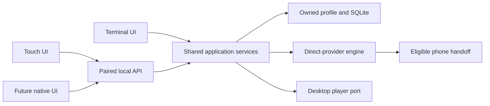

# Queue, offline, and phone experience follow-up

Status: unfinished. This records the user's computer-off, privacy-first phone
requirement and the remaining decisions; it does not claim a web companion,
native app, installer, or store release exists.

## Decision and recommended order

The phone must be useful with the personal computer off. A desktop companion
is optional. Prefer one shared identity/action/state contract with separate
terminal and touch presentations; do not build four new clients simultaneously.

1. Close real playback and request-profile gaps before adding more screens.
2. Present truthful current/starting/upcoming state, exact queue identity, and
   explicit post-play actions. Never consume an item merely because VLC opened.
3. Complete provider-independent offline playback, then qualify restart,
   cancellation, insufficient space, missing sidecars, and resume.
4. Reduce phone setup with a reviewed download and host launcher, then choose
   the common touch frontend after one real source works on each phone.
5. Add broader playlist conveniences and optional local recommendations after
   reliable first playback and offline continuity. A local model must not become
   an install prerequisite, analytics opt-in, or autonomous download trigger.

The source-backed [no-store comparison](../.reference/reviews/2026-10-03/mobile-no-store-options.md)
covers Home Screen web UI, on-phone host adapters, existing-app integration,
and optional desktop access. The remaining material decision is whether a
**user-owned always-on descriptor server** is acceptable or every resolver
operation must execute on the phone. A descriptor server needs a new bounded,
authorized API and returns metadata only; media remains direct. Neither option
is implemented or physically qualified.

## Local companion proposal, 2026-10-04

The user selected **both playback destinations**: control desktop mpv and hand
an eligible direct stream to VLC on the phone. Computer-off phone use remains
an independent requirement. This section is a proposed design, not an
implemented server, frontend, native wrapper, or approved release date.

### One application, several presentations

Use the same queue identity, claim/ack/rollback, history decisions, artifact
validation and download policy under CLI and touch surfaces. Reuse the provider
engine and storage packages; extract the smallest application seam needed for
one shared vertical slice. The current `packages/core` owns provider/resolver
primitives, not all application logic: queue and playback policy still live in
`apps/cli/src/app` and `apps/cli/src/domain/queue`. A new client must not import
the CLI app or Ink. See [runtime ownership](../.docs/runtime-boundary-map.md).

Run one service owner for the profile; two independent CLI/web workers must
not compete to claim queue items or acknowledge different player sessions.
The terminal is a presentation attached to this owner. First implementation
can keep the owner in the CLI process, with an explicit warning that closing
Kunai stops the companion. Background/headless lifetime is a later explicit
mode, with the existing profile-lock and shutdown contracts retained.

### Framework choice and extendibility

The lowest initial packaging burden is **TanStack Router + Query with static
assets served by Bun**. TanStack Start is reasonable if its server routes or
future rendering requirements earn the added build/server adapter. Start
[SPA mode](https://tanstack.com/start/latest/docs/framework/react/guide/spa-mode)
supports a client-rendered shell with server features and external APIs;
SSR is unnecessary for a private control panel. Its
[hosting guide](https://tanstack.com/start/latest/docs/framework/react/guide/hosting)
includes Bun. Prove the chosen production build can be bundled and started
without Vite, source checkout, npm installation or an internet asset host.

Keep a documented, versioned HTTP/event contract independent of Start RPC.
[Server functions](https://tanstack.com/start/latest/docs/framework/react/guide/server-functions)
are for Start's own client; stable endpoints for later native clients belong
in server routes or a plain local transport adapter. Validate and authorize
every endpoint: route-level beforeLoad checks are not a data boundary.
If Start is used, preserve its CSRF middleware rather than assuming typed
functions are safe merely because the UI uses them.

Keep `apps/docs` as the public docs app. Bundle a small version-matched help
subset into the companion at build time; it should work without a hosted site.
Reuse design tokens and application contracts, not the entire docs runtime.
A native wrapper can reuse the touch frontend, but local resolver execution,
background tasks, player callbacks and storage permissions remain native work.

### First useful touch slice

1. From Kunai, choose Connect phone, explicitly enable LAN access, scan a QR,
   and exchange a short-lived one-time pairing challenge. Show paired devices,
   revoke controls, connection state, server version and capability availability.
   No account or operated public website is required for this local mode.
2. Show Now Playing, Up Next and offline availability. Distinguish available
   **on computer** from downloaded **on this phone**. Offer buttons as well as
   optional drag/gesture reorder, large touch targets, labeled controls, visible
   focus, screen-reader status and reduced motion. Persist user intent after
   acknowledgement; on disconnect show uncertainty and resync before retry.
3. A destination chooser offers Computer or This phone. Desktop actions use
   the player port and its actual progress. Phone actions only offer providers
   whose request profile the target player can reproduce. VLC handoff does
   not assert playback started/completed; expose manual return/next until a
   verified callback contract exists. Do not consume Up Next merely on open.
4. Use service-owned snapshots plus versioned events for queue/download/player
   changes. Reconnect fetches a fresh snapshot; bounded events include identity,
   sequence and source revision. Mutations carry an idempotency key and expected
   state revision so repeated taps/reconnect cannot enqueue or claim twice.
5. Downloads run on the host and report committed job/artifact state. Retry,
   cancel and local resume need separate tests. Browser UI/metadata cache is
   not an offline video library or proof of phone background downloading.

Bind loopback by default. LAN access requires explicit enablement, Host/Origin
validation, device-scoped authorization, bounded bodies/rates and path/URL
allowlists. Do not expose a shell, arbitrary files, wildcard CORS or a media
proxy. One-time pairing does not encrypt plain HTTP: qualify a secure transport
before exposing persistent private control beyond the trusted preview. Plain
LAN HTTP is also not a secure-context Home Screen/service-worker guarantee.
The mobile browser sees the computer's address, not its own localhost.

### Delivery experiment and acceptance gates

The first experiment is a bundled browser companion on the same LAN while
Kunai runs: no public hosting, app-store submission or phone terminal UI.
A bookmark can make this quick to reopen; a remembered device can reconnect
when Kunai next starts without keeping a website online. Do not couple this
experiment to local AI, a global native-app rewrite or migration of public docs.

After shared queue/metadata works, Android can investigate a phone-local
Termux launcher serving the same touch assets on loopback. It still needs
host/runtime and background qualification. iPhone's a-Shell preview must not
be described as an always-running local daemon; computer-off resolution and
background/offline handling need a separately proven host or native route.
The companion alone therefore does not satisfy standalone phone parity.

Accept the slice only after: a production artifact starts from a clean install;
nontechnical pairing works on both physical phones; wrong-origin/unpaired and
revoked-device requests fail; repeat taps/reconnect preserve exact queue
identity; both destinations report only observable states; interrupted/failed
playback preserves intent; and local offline playback works after restart
without provider lookup. No calendar promise replaces these gates.

## Concrete source observations

The queue overlay used to label its first unplayed row `playing`, regardless
of its persisted status. Pending work now reads `up next`; an in-flight claim
reads `starting`. Queue consumption is confirmed playback startup, not watched
completion. A future Now Playing surface needs live player state and the exact
active intent, not the first pending row.

On 2026-10-03 at source snapshot
`6dd035443a52f75bfa332c10b556371b55e0248c`, fresh default-route signoff from
this host found:

| Case                             | Provider | Result                                                    |
| -------------------------------- | -------- | --------------------------------------------------------- |
| Dune, TMDB 438631                | VidLink  | No stream; subsequent resolve reported `not-found`        |
| Dutton Ranch S01E01, TMDB 299167 | VidLink  | Resolved and reachable using the supplied request profile |
| Onigiri E01, provider search     | HiAnime  | Resolved and reachable using the supplied request profile |

Independent bounded GETs to the latter two URLs **without headers/cookies**
returned HTTP 403. This is a concrete incompatibility with the current
URL-only phone preview, not evidence of universal provider outage. A desktop
probe with headers, or selecting another media player, cannot by itself prove
phone request parity. See the URL-free
[signoff](../.reference/reviews/2026-10-03/provider-signoff-followup.json) and
[phone comparison](../.reference/reviews/2026-10-03/phone-provider-compatibility.json).
No stream URL, cookie, or header value is retained in those files.

## UI contracts to implement next

Keep these separate in both desktop and future touch interfaces:

| Surface         | Owns                                       | Required visible actions and states                                                                     |
| --------------- | ------------------------------------------ | ------------------------------------------------------------------------------------------------------- |
| Now Playing     | Real active player session and destination | Current title/episode, paused/buffering/error, resume/seek where observable                             |
| Up Next         | Current watch intent                       | Next/end placement, reorder/remove/clear, starting, failed-start retry, explicit crash restore          |
| Playlists       | Durable saved collections                  | Create/name/add/remove/reorder/import/export; load into Up Next explicitly                              |
| Downloads       | Acquisition jobs                           | Confirm intent/profile/destination, queued/running/deferred/failed, retry/cancel/repair, storage reason |
| Offline library | Validated owned artifacts                  | Available here versus elsewhere, missing/repairable, local resume, explicit deletion                    |
| Post-play       | Actual playback outcome                    | Resume/replay, next item, source recovery, recommendations, return to browse                            |

The existing implementations already provide substantial parts of these
actions; this is the acceptance model for completing integration, not a claim
that they must all be rebuilt. Both anime and TMDB identity must survive each
action. External VLC handoff supports manual return/next unless a verified
progress/completion event contract is added.

For a networked companion, use service-owned read models and typed mutations,
per-device pairing/revocation, Host/Origin validation, bounded bodies and rates,
and idempotent mutations. Avoid direct database access from UI, shell command
strings, arbitrary paths/URLs, wildcard CORS on a control API, and a shared
media proxy. Browser caches can hold the UI and metadata; that is not downloaded
video. Phone background downloads and browser storage need separate gates.

The [existing offline plan](offline-provider-independent-playback.md) owns
retired-provider durability. This review does not duplicate or close that plan.
The [production review](2026-10-03-production-review.md) retains the wider
network trust, process teardown, publishing, and release-platform blockers.

## Device preparation and useful evidence

The user's Android and iPhone already have the chosen terminal hosts and VLC.
Use the prepared device-kit ZIP for developer qualification. USB/Files or
LocalSend transfers it; Android execution belongs in private Termux storage,
and iPhone execution requires all five helpers in one a-Shell mini directory.
Follow the [device lab](../.docs/mobile-device-lab.md).

The [public owned fixtures](../.reference/reviews/2026-10-03/phone-fixtures/README.md)
remove the need for a personal HTTPS server for the initial host/VLC check.
They are generated test patterns, not real-provider evidence. The artifact
set digests remain those of the device-kit metadata. Record help/version
return, input/cancellation, bounded HTTPS, state recovery, accepted handoff,
and visible playback separately. No physical row is complete yet.

After the baseline succeeds, re-resolve compatible real-provider sources
privately and test on both phones. Keep URLs out of evidence, screenshots,
diagnostics, issues, and commits. A failure must identify its boundary rather
than be recorded as a successful launch.

## Verification record for the queue correction

The two display suites reproduced seven failing assertions before the change.
Queue view, rendered 72/100/140-column frames, claims, startup rollback,
post-play, and lifecycle tests then passed: **33 tests, zero failures**.

Fresh complete verification: **8,100 passed, 60 skipped, zero failed**;
26 Turbo tasks, none cached. Typecheck (15 tasks), lint (14 tasks, zero errors),
formatting, document paths, and CLI build (10 tasks) passed uncached where
applicable. The first complete run timed out in the unchanged concurrent-version
installer test: 8,099 passed, 60 skipped, one failed. The isolated case passed,
all 93 installer cases passed, and the repeated full suite passed. No timeout
was raised and no installer runtime change was made; the one observed hang is
not diagnosed as resolved by the queue correction.

React Doctor 0.9.14 against the exact base reported zero new errors or warnings;
telemetry and score submission were disabled. Refreshing the tool through Bunx
did not finish, so this comparison used the same isolated cached version as the
earlier audit rather than claiming a newly fetched version or a health score.

The generated H.264/AAC fixture decoded locally with mpv. That does not prove
Android/iPhone playback. Required hosted checks and physical observations are
separate from these local results.
