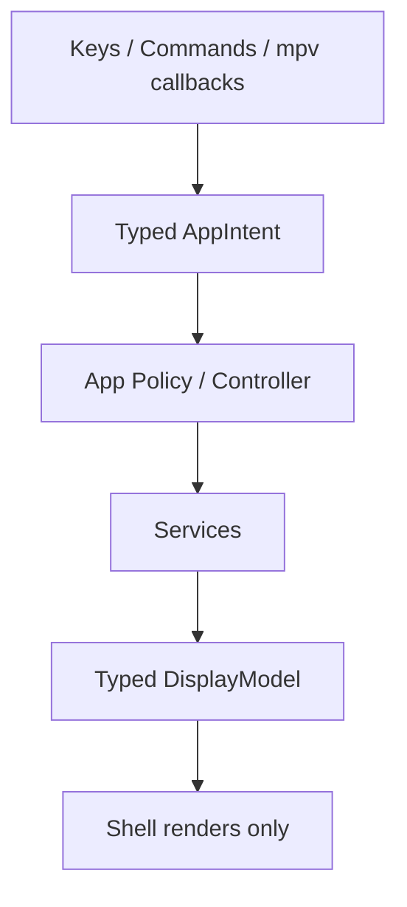
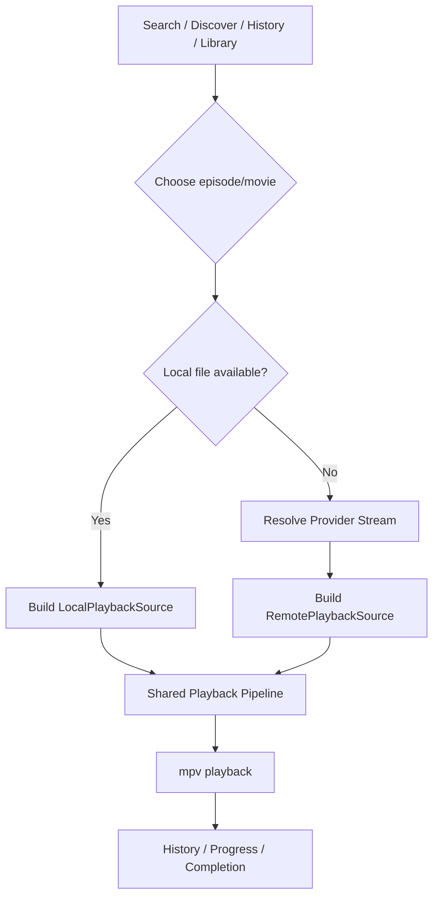
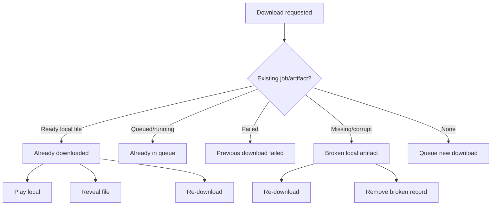

# Runtime Diagnostics, Offline, And Boundary Hardening Plan

Status: planned

## Progress Tracker

Use this section as the working tracker. Update checkboxes at phase boundaries, not for every tiny edit. Each phase should end with verification evidence and a commit unless the phase is intentionally split.

- [x] Phase 0: Stabilize and review the UI agent commit.
- [x] Phase 0a: Stabilize stream-health testability and timeout cleanup.
- [ ] Phase 1: Unified diagnostics service.
- [ ] Phase 2: Playback resolve/cache boundary cleanup.
- [ ] Phase 3: Typed intent and picker model.
- [ ] Phase 4: Offline library and local playback source.
- [ ] Phase 5: Scoped smart downloads and cleanup policy.
- [ ] Phase 6: Timeline, result enrichment, and details state.
- [ ] Phase 7: Tracks and media preference model.
- [ ] Phase 8: Live playback telemetry snapshot.
- [ ] Phase 9: Update service and install method detection.
- [ ] Phase 10: Docs and test hardening.
- [ ] Phase 11: Product polish and Zen mode.

### Commit Rhythm

- Commit the plan separately from implementation.
- Commit Phase 0a as a small stabilization patch.
- Commit each later phase in reviewable slices, preferably one service/contract boundary at a time.
- Do not bundle unrelated UI polish with diagnostics, playback, offline, or update-service changes.
- Before each commit, record the verification command and result in the commit message or handoff note.

## Goal

Make Kunai easier to debug, safer to extend, and better at offline/local playback before adding more large UI surfaces.

The product goal is simple: users should be able to search, stream, download, watch offline, recover from provider churn, export useful diagnostics, and update the app without feeling like they are operating a fragile pile of scripts.

## Current Context

Another agent has recently implemented the UI/UX overhaul slices for loading states, playback supervision, post-playback recommendations, and stream health validation. That work should be stabilized before starting new high-risk phases such as live mpv telemetry polling, `/tracks`, or the offline library overhaul.

This plan is the next architecture track after that stabilization report. It should be executed in order unless a production-blocking bug forces a smaller emergency fix.

## Non-Negotiables

- Playback reliability stays the center of the product.
- UI renders state; services and policies decide behavior.
- No new giant orchestration file.
- No provider-specific quirks leaking into shell components.
- No duplicate normal/prefetch/download/offline resolve paths when one shared policy can own them.
- No silent destructive cleanup.
- No debugging through `console.log` inside Ink render paths.
- Every user-visible failure should have a subsystem, stage, reason, and next action.
- Tests should cover policies and contracts, not only snapshots or happy paths.

## Architecture Principles

### Typed Intent First

Commands, hotkeys, mpv callbacks, overlays, and picker selections should resolve into typed app intents before execution.



### One Canonical Picker Model

All pickers should share the same ordering and selection contract:

- command palette
- episode picker
- provider picker
- source/quality picker
- recommendation picker
- downloads/library action pickers
- future `/tracks` picker

Rendering order, keyboard navigation order, and executed selection must come from the same model.

### Local Playback Is A Source, Not A Separate Player

`/library` is a separate browsing surface, but playing a downloaded file should enter the normal playback pipeline.



## Phase 0: Stabilize The UI Agent Commit

### Purpose

Do not stack high-risk features on top of fresh runtime/UI changes until the existing changes are reviewed.

### Inputs

- Feature commit: `32402aa feat(ui): richer loading, playback supervision, recommendations, and stream health`
- Formatting commit: `6c091cc style(plan): oxfmt formatting for ui-ux-overhaul-implementation.md`
- UI plan: `.plans/ui-ux-overhaul-implementation.md`

### Review Checklist

- Stream health validation preserves provider headers and referers.
- Stream health validation avoids redundant checks for fresh streams.
- Stream health validation does not rely only on `HEAD` where lightweight `GET` is safer.
- Cache health failures transparently refetch without breaking playback.
- Cache hit, validated hit, refetch, and health failure are diagnosable.
- Post-playback recommendations stay in context.
- Post-playback recommendations do not mutate search results as a workaround.
- Empty recommendation states stay understandable.
- Loading stages are derived from domain/playback events, not UI guesses.
- Minimal/small-terminal layouts still have usable loading and playback states.
- Picker render order and keyboard selection order are deterministic.

### Tests To Add Or Confirm

- Stream health fresh-cache bypass.
- Stream health stale-cache refetch.
- Stream health preserves headers.
- Recommendation overlay action stays in post-playback context.
- Command picker order and selection parity.
- Loading-stage mapping from playback feedback/events.

### Output

A short audit note in the active chat or `.plans/ui-ux-overhaul-implementation.md` containing:

- architecture-sensitive files touched
- changed runtime behavior
- tests added
- tests still missing
- manual verification steps
- known risks

## Phase 0a: Stream Health Stabilization

### Purpose

Make the shipped stream-health validation deterministic and safe before using it as a foundation for diagnostics and playback-boundary cleanup.

### Current Problem

The audit confirmed the stream-health direction is useful, but the current implementation has two planning risks:

- stream-health tests may depend on real network endpoints
- cache validation uses a 2-hour threshold while the current stream cache TTL is much shorter

The threshold mismatch is not a blocker for diagnostics, but the testability issue should be fixed before broader implementation.

### Target Files

- Modify: `apps/cli/src/services/playback/PlaybackResolveService.ts`
- Modify: `apps/cli/test/unit/services/playback/playback-resolve-service.test.ts`
- Create if useful: `apps/cli/src/services/playback/stream-health-check.ts`
- Create if useful: `apps/cli/test/unit/services/playback/stream-health-check.test.ts`

### Tasks

- [ ] Remove real-network endpoints from stream-health tests.
- [ ] Extract or inject stream-health fetch behavior so tests can use a fake fetch.
- [ ] Preserve provider headers on `HEAD` and ranged `GET` validation attempts.
- [ ] Ensure validation timers are cleared with `finally` or equivalent cleanup.
- [ ] Test that `HEAD` failure falls back to ranged `GET`.
- [ ] Test that failed validation deletes the cache entry and refetches through the provider engine.
- [ ] Add a short code comment or plan note that the 2-hour threshold vs 15-minute TTL mismatch is deferred to Phase 2 policy cleanup.
- [ ] Run targeted stream-health tests.
- [ ] Run `bun run typecheck`, `bun run lint`, and `bun run fmt`.

### Done Criteria

- No default unit test depends on external network.
- Stream-health behavior is covered by deterministic tests.
- Timeout cleanup cannot leak timers on success, failure, or abort.
- No user-facing behavior changes beyond safer validation implementation.

## Phase 1: Unified Diagnostics Service

### Purpose

Replace split-brain debugging with one runtime event and trace system that feeds logs, the diagnostics panel, support exports, and tests.

### Current Problem

Kunai currently has separate partial systems:

- `apps/cli/src/logger.ts` has `dbg()` debug lines.
- `apps/cli/src/infra/logger/StructuredLogger.ts` logs a different shape.
- `apps/cli/src/services/diagnostics/DiagnosticsStoreImpl.ts` stores a bounded in-memory event list.
- `apps/cli/src/infra/tracer/TracerImpl.ts` exists but does not persist useful span details.
- `/export-diagnostics` exports only the in-memory diagnostics snapshot.

### Target Files

- Create: `apps/cli/src/services/diagnostics/DiagnosticsService.ts`
- Create: `apps/cli/src/services/diagnostics/DiagnosticsServiceImpl.ts`
- Create: `apps/cli/src/services/diagnostics/diagnostic-event.ts`
- Create: `apps/cli/src/services/diagnostics/redaction.ts`
- Create: `apps/cli/src/services/diagnostics/support-bundle.ts`
- Modify: `apps/cli/src/container.ts`
- Modify: `apps/cli/src/services/diagnostics/DiagnosticsStore.ts`
- Modify: `apps/cli/src/services/diagnostics/DiagnosticsStoreImpl.ts`
- Modify: `apps/cli/src/infra/logger/StructuredLogger.ts`
- Modify: `apps/cli/src/infra/tracer/Tracer.ts`
- Modify: `apps/cli/src/infra/tracer/TracerImpl.ts`
- Modify: `apps/cli/src/app-shell/workflows.ts`
- Test: `apps/cli/test/unit/diagnostics/diagnostics-service.test.ts`
- Test: `apps/cli/test/unit/diagnostics/redaction.test.ts`
- Test: `apps/cli/test/unit/diagnostics/support-bundle.test.ts`

### Event Contract

Use one event shape for user-facing diagnostics and debug export.

```ts
export type DiagnosticLevel = "debug" | "info" | "warn" | "error";

export type DiagnosticCategory =
  | "session"
  | "search"
  | "provider"
  | "subtitle"
  | "playback"
  | "cache"
  | "ui"
  | "presence"
  | "download"
  | "offline"
  | "update";

export type DiagnosticEvent = {
  readonly timestamp: number;
  readonly level: DiagnosticLevel;
  readonly category: DiagnosticCategory;
  readonly operation: string;
  readonly message: string;
  readonly traceId?: string;
  readonly spanId?: string;
  readonly titleId?: string;
  readonly providerId?: string;
  readonly season?: number;
  readonly episode?: number;
  readonly context?: Record<string, unknown>;
};
```

### Support Bundle Contract

`/export-diagnostics` should export a redacted support bundle:

```ts
export type DiagnosticsSupportBundle = {
  readonly exportedAt: string;
  readonly app: {
    readonly version: string;
    readonly debug: boolean;
  };
  readonly runtime: {
    readonly platform: string;
    readonly arch: string;
    readonly bunVersion: string;
  };
  readonly capabilities: Record<string, unknown>;
  readonly eventCount: number;
  readonly events: readonly DiagnosticEvent[];
};
```

### Redaction Policy

Redact:

- stream URLs
- signed query strings
- auth-like headers
- cookies
- tokens
- local usernames in paths when possible

Keep:

- provider id
- status codes
- failure stages
- cache policy class
- timing values
- command names
- feature availability

### Tasks

- [ ] Add diagnostic event types and redaction helpers.
- [ ] Add unit tests for URL, header, cookie, token, and path redaction.
- [ ] Add `DiagnosticsService` facade over store, logger, and tracer.
- [ ] Add trace/span support that records attributes and events.
- [ ] Wire `DiagnosticsService` in `container.ts`.
- [ ] Update `/export-diagnostics` to write a support bundle.
- [ ] Convert high-value playback/provider/cache/download events to the new service.
- [ ] Keep the existing diagnostics panel working during migration.
- [ ] Update `.docs/diagnostics-guide.md`.
- [ ] Run `bun run typecheck`, `bun run lint`, `bun run fmt`, and relevant tests.

## Phase 2: Playback Resolve And Cache Boundary Cleanup

### Purpose

Make normal resolve, refresh, prefetch, and download re-resolve use one shared policy path where possible.

### Current Problem

`PlaybackResolveService` owns normal resolve/cache behavior, while prefetch and some download re-resolve behavior can bypass the same policy. This risks drift in fallback, cache health, diagnostics, preferences, and provider health.

### Target Files

- Create: `apps/cli/src/services/playback/PlaybackResolveCoordinator.ts`
- Create: `apps/cli/src/services/playback/StreamHealthService.ts`
- Create: `apps/cli/src/services/playback/stream-health-policy.ts`
- Create: `apps/cli/src/services/playback/playback-source.ts`
- Modify: `apps/cli/src/services/playback/PlaybackResolveService.ts`
- Modify: `apps/cli/src/app/PlaybackPhase.ts`
- Modify: `apps/cli/src/services/download/DownloadService.ts`
- Test: `apps/cli/test/unit/services/playback/stream-health-policy.test.ts`
- Test: `apps/cli/test/unit/services/playback/playback-resolve-coordinator.test.ts`

### Design

The coordinator should return structured provenance:

```ts
export type PlaybackResolveProvenance =
  | "fresh"
  | "cache-hit"
  | "cache-hit-validated"
  | "cache-hit-unvalidated"
  | "cache-refetched"
  | "prefetched";
```

Stream health should be policy-driven:

- do not probe very fresh streams
- use provider headers
- prefer lightweight manifest `GET` for HLS when `HEAD` is unreliable
- use `HEAD` or ranged `GET` for direct files
- never turn a successful fresh resolve into a failure because diagnostics persistence failed

### Tasks

- [ ] Add pure `stream-health-policy` tests for fresh, stale, HLS, direct-file, and no-cache cases.
- [ ] Add `StreamHealthService` with injectable fetch for tests.
- [ ] Add tests proving headers are preserved during health checks.
- [ ] Add `PlaybackResolveCoordinator` tests for normal hit, stale refetch, failed refetch fallback, and prefetched stream.
- [ ] Move prefetch path in `PlaybackPhase` onto the coordinator.
- [ ] Ensure refresh deletes/invalidates the same cache key the coordinator uses.
- [ ] Emit diagnostics events for cache hit, health check, refetch, and failure.
- [ ] Run typecheck/lint/fmt/tests.

## Phase 3: Typed Intent And Picker Model

### Purpose

Prevent UI state, command routing, and picker behavior from drifting.

### Target Files

- Create: `apps/cli/src/domain/session/AppIntent.ts`
- Create: `apps/cli/src/domain/session/PickerModel.ts`
- Create: `apps/cli/src/domain/session/picker-model.ts`
- Modify: `apps/cli/src/domain/session/command-registry.ts`
- Modify: `apps/cli/src/app-shell/shell-command-ui.tsx`
- Modify: `apps/cli/src/app-shell/command-router.ts`
- Modify: `apps/cli/src/app-shell/picker-controller.ts`
- Test: `apps/cli/test/unit/app-shell/picker-model.test.ts`
- Test: `apps/cli/test/unit/app-shell/command-router.test.ts`

### Design

`PickerModel` should be the single source of truth for:

- raw items
- visible items
- grouping
- highlighted id
- disabled reason
- selected action

Rendering should never regroup items in a way that changes selection semantics.

### Tasks

- [ ] Add `PickerModel` pure helpers and tests.
- [ ] Convert command palette matching to return a picker model.
- [ ] Add regression test for grouped command render order vs selected command.
- [ ] Convert one low-risk picker to the shared model.
- [ ] Document migration rules for remaining pickers.
- [ ] Run typecheck/lint/fmt/tests.

## Phase 4: Offline Library And Local Playback Source

### Purpose

Make downloaded media feel like first-class playback, not a separate mpv shortcut.

### Target Files

- Create: `apps/cli/src/services/offline/OfflineLibraryService.ts`
- Create: `apps/cli/src/services/offline/local-playback-source.ts`
- Create: `apps/cli/src/services/offline/offline-sync-policy.ts`
- Modify: `apps/cli/src/services/offline/offline-library.ts`
- Modify: `apps/cli/src/app/OfflineLibraryPhase.ts`
- Modify: `apps/cli/src/infra/player/PlayerService.ts`
- Modify: `apps/cli/src/infra/player/PlayerServiceImpl.ts`
- Modify: `apps/cli/src/app/PlaybackPhase.ts`
- Modify: `packages/storage/src/repositories/download-jobs.ts`
- Test: `apps/cli/test/unit/services/offline/offline-library-service.test.ts`
- Test: `apps/cli/test/unit/app/offline-playback-history.test.ts`

### Design

`OfflineLibraryService` owns:

- listing completed jobs
- hydrating artifact status
- resolving duplicate completed artifacts
- building local playback sources
- marking missing or invalid artifacts
- producing re-download intents

Local playback source:

```ts
export type LocalPlaybackSource = {
  readonly kind: "local";
  readonly titleId: string;
  readonly titleName: string;
  readonly mediaKind: "movie" | "series";
  readonly season?: number;
  readonly episode?: number;
  readonly filePath: string;
  readonly subtitlePath?: string;
  readonly subtitleLanguage?: string;
  readonly introSkipJson?: string;
  readonly durationMs?: number;
  readonly fileSize?: number;
  readonly qualityLabel?: string;
  readonly audioMode?: "sub" | "dub";
};
```

### Already Downloaded Behavior

When the user tries to download an item:



### Tasks

- [ ] Add tests for duplicate completed artifact resolution.
- [ ] Add tests for missing, invalid, and ready artifact hydration.
- [ ] Add `LocalPlaybackSource` builder.
- [ ] Add tests proving local source includes subtitle sidecar and timing metadata.
- [ ] Route local playback through the normal player/history path.
- [ ] Add tests proving offline playback writes the same history shape as online playback.
- [ ] Add library sync action that validates artifacts without deleting records automatically.
- [ ] Run typecheck/lint/fmt/tests.

## Phase 5: Scoped Smart Downloads And Cleanup Policy

### Purpose

Make downloads helpful without bombarding users or eating disk unexpectedly.

### Target Files

- Create: `apps/cli/src/services/download/download-scope-policy.ts`
- Create: `apps/cli/src/services/download/smart-download-policy.ts`
- Create: `apps/cli/src/services/download/download-cleanup-policy.ts`
- Modify: `apps/cli/src/services/download/DownloadService.ts`
- Modify: `apps/cli/src/services/persistence/ConfigService.ts`
- Modify: `apps/cli/src/services/persistence/ConfigServiceImpl.ts`
- Test: `apps/cli/test/unit/services/download/download-scope-policy.test.ts`
- Test: `apps/cli/test/unit/services/download/download-cleanup-policy.test.ts`

### Scope Model

```ts
export type DownloadScope =
  | { readonly type: "current-episode" }
  | { readonly type: "next-episode" }
  | { readonly type: "next-n"; readonly count: number }
  | { readonly type: "current-season-remaining" }
  | {
      readonly type: "manual-selection";
      readonly episodes: readonly { season: number; episode: number }[];
    };
```

### Cleanup Rules

Auto-clean should be conservative:

- never delete unwatched files
- never delete pinned files
- never delete the current or next intended episode
- keep history even when deleting files
- prefer cleanup after next episode is safely downloaded
- expose cleanup decisions in diagnostics

### Tasks

- [ ] Add pure scope policy tests.
- [ ] Add pure cleanup policy tests.
- [ ] Add config fields only after policy tests define defaults.
- [ ] Add “keep next N” queue behavior behind opt-in config.
- [ ] Add auto-clean candidate selection without automatic deletion first.
- [ ] Add explicit cleanup command or confirmation path.
- [ ] Run typecheck/lint/fmt/tests.

## Phase 6: Timeline, Result Enrichment, And Details State

### Purpose

Make search, details, episode pickers, and calendar surfaces aware of history, offline availability, and release timing without provider-resolving everything.

### Target Files

- Create: `apps/cli/src/services/catalog/TimelineService.ts`
- Create: `apps/cli/src/services/catalog/ResultEnrichmentService.ts`
- Create: `apps/cli/src/app/title-display-model.ts`
- Modify: `apps/cli/src/services/catalog/CatalogScheduleService.ts`
- Modify: `apps/cli/src/app/discover-results.ts`
- Modify: `apps/cli/src/app/playback-episode-picker.ts`
- Test: `apps/cli/test/unit/services/catalog/timeline-service.test.ts`
- Test: `apps/cli/test/unit/services/catalog/result-enrichment-service.test.ts`

### Surfaces

- browse result badges
- details panel
- episode picker
- timeline/calendar screen
- post-playback next release banner

### Badges

Potential badges:

- downloaded
- downloading
- watched
- partially watched
- new today
- upcoming
- provider degraded
- failed download

### Tasks

- [ ] Add timeline service tests for airing today and next release.
- [ ] Add result enrichment tests for history and offline badges.
- [ ] Add display model for title/details state.
- [ ] Keep enrichment non-blocking and cache-aware.
- [ ] Run typecheck/lint/fmt/tests.

## Phase 7: Tracks And Media Preference Model

### Purpose

Prepare `/tracks` without creating a mega-picker that mixes preferences, actual provider tracks, and active mpv track state.

### Target Files

- Create: `apps/cli/src/domain/media/media-preferences.ts`
- Create: `apps/cli/src/domain/media/media-track-model.ts`
- Create: `apps/cli/src/services/playback/MediaTrackService.ts`
- Modify: `apps/cli/src/domain/types.ts`
- Modify: `apps/cli/src/app/subtitle-selection.ts`
- Modify: `apps/cli/src/app/source-quality.ts`
- Test: `apps/cli/test/unit/domain/media/media-track-model.test.ts`

### Model Split

- desired preference: what the user wants by default
- provider inventory: what the provider exposed
- selected stream/source: what Kunai picked
- active mpv track: what the player is currently using
- switching capability: whether track switching is possible now

### Tasks

- [ ] Add tests for preference labels and fallback copy.
- [ ] Add tests for provider inventory vs active mpv state.
- [ ] Normalize current subtitle/source models into the media track model.
- [ ] Defer UI picker until model is stable.
- [ ] Run typecheck/lint/fmt/tests.

## Phase 8: Live Playback Telemetry Snapshot

### Purpose

Make playback supervision dynamic without unsafe IPC polling.

### Target Files

- Create: `apps/cli/src/infra/player/PlaybackTelemetrySnapshot.ts`
- Modify: `apps/cli/src/infra/player/PlayerControlService.ts`
- Modify: `apps/cli/src/infra/player/PlayerControlServiceImpl.ts`
- Modify: `apps/cli/src/infra/player/PersistentMpvSession.ts`
- Test: `apps/cli/test/unit/infra/player/playback-telemetry-snapshot.test.ts`

### Design

Expose a snapshot API only after the player infra owns the state:

```ts
export type PlaybackTelemetrySnapshot = {
  readonly positionSeconds?: number;
  readonly durationSeconds?: number;
  readonly cacheAheadSeconds?: number;
  readonly cacheSpeedBytesPerSecond?: number;
  readonly bufferingPercent?: number;
  readonly seeking?: boolean;
  readonly pausedForCache?: boolean;
  readonly voConfigured?: boolean;
  readonly updatedAt: number;
};
```

### Tasks

- [ ] Add snapshot type and pure formatting tests.
- [ ] Store latest observed telemetry in player infra.
- [ ] Add read-only `getTelemetrySnapshot()` to player control.
- [ ] Ensure no new aggressive polling loop is introduced.
- [ ] Feed cockpit display from snapshots only after the API is stable.
- [ ] Run typecheck/lint/fmt/tests.

## Phase 9: Update Service And Install Method Detection

### Purpose

Let users know when Kunai is out of date and offer safe, install-method-aware update guidance.

### Target Files

- Create: `apps/cli/src/services/update/UpdateService.ts`
- Create: `apps/cli/src/services/update/install-method.ts`
- Create: `apps/cli/src/services/update/update-check-cache.ts`
- Modify: `apps/cli/src/services/persistence/ConfigService.ts`
- Modify: `apps/cli/src/app-shell/workflows.ts`
- Test: `apps/cli/test/unit/services/update/update-service.test.ts`
- Test: `apps/cli/test/unit/services/update/install-method.test.ts`

### Rules

- do not block startup
- cache checks daily or weekly
- allow disable/snooze
- never run install commands silently
- detect npm, bun global, source checkout, binary/package, or unknown
- record update checks and failures in diagnostics

### Tasks

- [ ] Add install method detection tests.
- [ ] Add update check cache tests.
- [ ] Add update service with injectable latest-version fetch.
- [ ] Add non-blocking startup notice.
- [ ] Add update/snooze commands.
- [ ] Add docs for update behavior.
- [ ] Run typecheck/lint/fmt/tests.

## Phase 10: Docs And Test Hardening

### Purpose

Make Kunai easier for users to learn and easier for maintainers to verify.

### User Docs

- `docs/users/getting-started.md`
- `docs/users/playback-and-recovery.md`
- `docs/users/downloads-and-offline.md`
- `docs/users/diagnostics-and-reporting.md`
- `docs/users/install-and-update.md`

### Developer Docs

- `.docs/diagnostics-guide.md`
- `.docs/testing-strategy.md`
- `.docs/download-offline-onboarding.md`
- `.docs/architecture.md`
- `.docs/runtime-boundary-map.md`

### Test Targets

- diagnostics redaction and support bundle
- picker model order/selection
- stream health/cache policy
- offline artifact sync
- local playback history
- smart download scope
- cleanup candidate selection
- update check/snooze behavior
- timeline release classification

### Tasks

- [ ] Add docs skeletons only after the corresponding feature contracts exist.
- [ ] Keep README short and route users to docs.
- [ ] Add test matrix to `.docs/testing-strategy.md`.
- [ ] Run full verification: `bun run typecheck`, `bun run lint`, `bun run fmt`, `bun run test`.

## Phase 11: Product Polish And Zen Mode

### Purpose

Make the complete app feel cohesive, calm, fast, and intentional after architecture is stable.

This is the “make it feel excellent” phase. It should not introduce new architecture unless polish reveals a real boundary bug.

### Surfaces

- home/search/browse
- details panel
- episode picker
- provider picker
- source/quality picker
- tracks picker
- loading screen
- active playback cockpit
- recovery picker
- post-playback hub
- recommendation picker
- downloads queue
- offline library
- history
- timeline/calendar
- diagnostics
- setup/onboarding
- settings
- update prompt
- help/about

### Principles

- same command behavior everywhere
- same empty/loading/error state grammar
- same badge vocabulary everywhere
- minimal mode is a projection of the same state, not a second code path
- errors should suggest the next useful action
- offline should feel comforting, not technical
- diagnostics can be nerdy, but normal screens should be human

### Tasks

- [ ] Audit copy and labels across all surfaces.
- [ ] Remove duplicated state labels.
- [ ] Normalize badge language.
- [ ] Normalize footer/action rhythm.
- [ ] Verify minimal/zen mode uses the same display models.
- [ ] Add VHS or manual visual verification for major shell flows.
- [ ] Run full verification.

## Execution Order

1. Phase 0: Stabilize UI agent commit.
2. Phase 0a: Stream health stabilization.
3. Phase 1: Unified diagnostics service.
4. Phase 2: Playback resolve/cache boundary cleanup.
5. Phase 3: Typed intent and picker model.
6. Phase 4: Offline library and local playback source.
7. Phase 5: Scoped smart downloads and cleanup policy.
8. Phase 6: Timeline, result enrichment, and details state.
9. Phase 7: Tracks and media preference model.
10. Phase 8: Live playback telemetry snapshot.
11. Phase 9: Update service and install method detection.
12. Phase 10: Docs and test hardening.
13. Phase 11: Product polish and Zen mode.

## When To Stop And Replan

Stop and replan if:

- `PlaybackPhase.ts` grows significantly instead of shrinking.
- another service starts rendering UI copy directly.
- stream health introduces provider breakage or slow startup.
- diagnostics export risks leaking signed stream URLs or secrets.
- offline playback forks history/progress behavior from online playback.
- smart downloads deletes user files without explicit policy and diagnostics.
- `/tracks` requires provider-specific branches inside shell components.
- update checks block startup or run package manager commands silently.

## Verification Commands

Before considering a phase complete:

```sh
bun run typecheck
bun run lint
bun run fmt
```

When tests are relevant and available:

```sh
bun run test
```

Use live provider smoke tests only for provider/network reality checks, not as the only proof of correctness.
