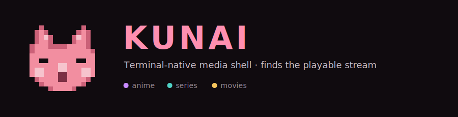
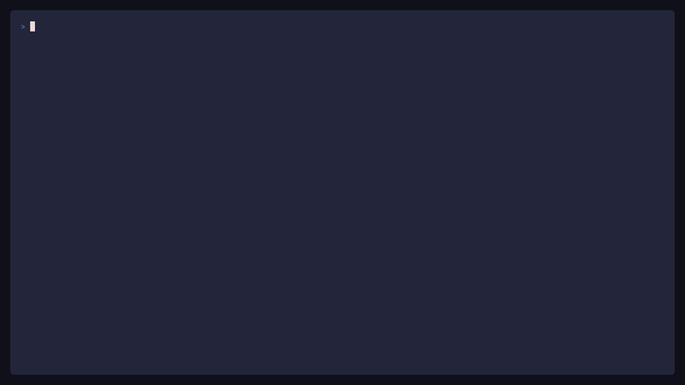

<div align="center">



**Search any title · pick your source · watch in `mpv` · download for offline.**
One fullscreen, keyboard-driven terminal session.

[](https://www.npmjs.com/package/@kitsunekode/kunai)
&nbsp;
&nbsp;
&nbsp;
&nbsp;[](LICENSE)

```bash
# Zero prerequisites — installs a self-contained binary (no Bun/Node needed)
curl -fsSL https://raw.githubusercontent.com/KitsuneKode/kunai/main/install.sh | bash
kunai -S "Dune"
```

</div>

---

## Table of Contents

- [Why Kunai](#why-kunai)
- [Showcase](#showcase)
- [Quick Start](#quick-start)
  - [Install](#install)
  - [Install by platform](#install-by-platform)
  - [What you need up front](#what-you-need-up-front)
- [Usage](#usage)
- [Key Bindings](#key-bindings)
- [Features](#features)
- [Dependencies — in detail](#dependencies--in-detail)
- [Configuration](#configuration)
- [Providers](#providers)
- [FAQ](#faq)
- [Architecture](#architecture-for-contributors)
- [Development](#development)
- [Uninstall](#uninstall)
- [Contributing](#contributing)
- [Appreciation](#appreciation)
- [Disclaimer](#disclaimer)

---

## Why Kunai

Kunai is a terminal-first media shell. You search a title, pick a source, and it
hands a direct stream to `mpv` — no browser, no tabs, no ads, no mouse. One
fullscreen keyboard session covers anime, series, and movies, with offline
downloads, a release calendar, watch history, and Discord Rich Presence built in.

It takes the daily-driver confidence of tools like `ani-cli` and extends it into
an app-grade browsing experience that keeps search, details, episodes, and
playback connected — while staying a deterministic, scriptable CLI.

---

## Showcase

The command palette (`/`) reaches every surface — here, the offline shell touring
help, diagnostics, and watch history without leaving the session:

<div align="center">



</div>

More demos — the setup wizard and the offline library — regenerate locally with
`bun run --cwd apps/cli test:vhs:all` (output in the gitignored
`apps/cli/test/vhs/golden/`).

---

## Quick Start

### Install

The recommended install downloads a **self-contained binary** with the Bun
runtime embedded — **no Bun or Node required**. It verifies a SHA256 checksum,
records how you installed (so `kunai upgrade` does the right thing), and works on
Linux, macOS, and Windows.

```bash
# Recommended — zero prerequisites
curl -fsSL https://raw.githubusercontent.com/KitsuneKode/kunai/main/install.sh | bash

# Windows (PowerShell)
irm https://raw.githubusercontent.com/KitsuneKode/kunai/main/install.ps1 | iex

# Inspect first, pin a version, or pick a channel
curl -fsSL https://raw.githubusercontent.com/KitsuneKode/kunai/main/install.sh | bash -s -- --dry-run
curl -fsSL https://raw.githubusercontent.com/KitsuneKode/kunai/main/install.sh | bash -s -- --version 0.3.0
```

Then run `kunai` to open the shell, or `kunai -S "Dune"` to search directly.
Inside the shell, `/` opens the command palette from anywhere.

Keep it current with `kunai upgrade`; remove it with `kunai --uninstall`
(add `--purge` to also delete config/history/cache).

> **Alternatives for developers / Bun users** (these require Bun `>=1.3.9` at
> runtime — the published `dist/kunai.js` starts with `#!/usr/bin/env bun`):
>
> ```bash
> # npm or bun global
> npm install -g @kitsunekode/kunai      # or: bun install -g @kitsunekode/kunai
> # the installer can do this too: install.sh ... | bash -s -- --method npm
>
> # From source
> git clone https://github.com/kitsunekode/kunai.git
> cd kunai && bun install && bun run link:global
> ```

### Install by platform

With the binary install, **mpv is the only required dependency**. The rest are
optional and auto-detected — install what you want, then run `kunai --setup` to
confirm.

<details>
<summary><b>Arch Linux</b></summary>

```bash
# Required
sudo pacman -S mpv
# Optional: downloads, poster previews, integrity checks
sudo pacman -S yt-dlp chafa imagemagick ffmpeg
```

</details>

<details>
<summary><b>Debian / Ubuntu</b></summary>

```bash
# Required
sudo apt install mpv
# Optional: downloads, poster previews, integrity checks
sudo apt install yt-dlp chafa imagemagick ffmpeg
```

</details>

<details>
<summary><b>macOS (Homebrew)</b></summary>

```bash
# Required
brew install mpv
# Optional: downloads, poster previews, integrity checks
brew install yt-dlp chafa imagemagick ffmpeg
```

</details>

<details>
<summary><b>Windows (winget)</b></summary>

```bash
# Required
winget install mpv
# Optional: downloads, poster previews, integrity checks
winget install yt-dlp hpjansson.Chafa ImageMagick.ImageMagick Gyan.FFmpeg
```

> `ffprobe` ships inside the FFmpeg package on every platform.

</details>

### What you need up front

| Tool            | Required?      | Why                                                                         |
| --------------- | -------------- | --------------------------------------------------------------------------- |
| **Bun** ≥1.3.9  | npm/bun/source | Runtime for non-binary installs. The default binary embeds it — not needed. |
| **mpv**         | Required       | Plays everything. `sudo pacman -S mpv` / `brew install mpv`                 |
| **yt-dlp**      | Optional       | Offline downloads. `sudo pacman -S yt-dlp` / `brew install yt-dlp`          |
| **ffprobe**     | Optional       | Post-download integrity checks (ships with FFmpeg)                          |
| **chafa**       | Optional       | Poster previews in non-Kitty terminals. `sudo pacman -S chafa`              |
| **ImageMagick** | Optional       | Broader poster format support. `sudo pacman -S imagemagick`                 |
| **Discord**     | Optional       | Rich Presence (watching status on profile)                                  |

If mpv is missing, Kunai won't start playback. Everything else is optional and
detected automatically — the setup wizard (`/setup` or `kunai --setup`) walks
through each capability and what it enables.

---

## Usage

### Launch commands

```bash
# Interactive: search, browse, discover
kunai

# Direct search
kunai -S "Dune"
kunai -S "Cowboy Bebop" --jump 1

# Anime mode
kunai -a -S "Attack on Titan"

# Open a known TMDB id directly
kunai -i 438631 -t movie

# Resume where you left off
kunai --continue
kunai --history

# Discover and calendar
kunai --discover
kunai --calendar
kunai --random

# Offline and downloads
kunai --offline
kunai --download -S "Dune"
kunai --download -S "Dune" --download-path ~/Videos/Kunai

# Minimal chrome (zen mode)
kunai --zen --offline

# Setup wizard / verbose traces
kunai --setup
kunai --debug
```

### Inside the shell

Every screen has a context-sensitive footer showing the keys available right
there. The ones you'll reach for most:

```text
/                 Command palette (from anywhere)
Enter             Search, open, confirm
Esc               Close, clear, go back
↑↓                Navigate results, episodes, options
Tab               Switch between anime/series mode
Ctrl+T            Reload trending recommendations
Ctrl+D            Download selected result (from browse)
```

---

## Key Bindings

### During search / browse

| Key           | Action                                                           |
| ------------- | ---------------------------------------------------------------- |
| `/`           | Open command palette                                             |
| `Enter`       | Open selected result                                             |
| `Esc`         | Clear query / go back                                            |
| `↑↓`          | Navigate results                                                 |
| `Tab`         | Toggle anime/series mode                                         |
| `Ctrl+T`      | Reload trending                                                  |
| `Ctrl+D`      | Download selected result                                         |
| Type a filter | Narrow provider, season, subtitle, history, and settings pickers |

### During playback

| Key      | Action                                     |
| -------- | ------------------------------------------ |
| `q`      | Stop playback, return to controls          |
| `n`      | Next episode                               |
| `p`      | Previous episode                           |
| `r`      | Recover current stream                     |
| `f`      | Try next compatible provider               |
| `d`      | Queue download of current episode          |
| `k`      | Source / quality picker                    |
| `o`      | Switch provider                            |
| `e`      | Episode picker                             |
| `s`      | Reload / switch subtitles                  |
| `b`      | Skip intro, recap, or credits              |
| `a`      | Toggle autoplay on/off                     |
| `u`      | Toggle autoskip on/off                     |
| `x`      | Stop after current episode                 |
| `Ctrl+R` | Manual resume prompt (when history exists) |

### Command palette (`/`)

| Command        | What it does                                         |
| -------------- | ---------------------------------------------------- |
| `/search`      | Start a new search                                   |
| `/library`     | Browse offline titles, manage queue, toggle settings |
| `/download`    | Queue the current episode for download               |
| `/queue`       | View active, queued, failed downloads                |
| `/discover`    | Personalized recommendations + trending              |
| `/calendar`    | Unified release calendar — anime · series · movies   |
| `/random`      | Surprise pick without autoplay                       |
| `/setup`       | Run the setup wizard                                 |
| `/settings`    | Configure provider, language, downloads, Discord     |
| `/history`     | Watch history and resume                             |
| `/diagnostics` | Runtime snapshot and recent events                   |
| `/presence`    | Discord Rich Presence setup                          |

---

## Features

### Search and discover

- **Search** any title by name. Anime and series modes use different provider sets.
- **Stack filters** in one query: `type:anime year:2026 rating:7 genre:isekai audio:ja subtitles:en`.
- **Discover** personalized recommendations and trending titles.
- **Release calendar** is one content-kind–aware window across anime, series, and movies — filter by type (Tab) or day (←/→), with honest "airs today / releases / available" status. Provider resolution happens only after you open a row.
- **Random / Surprise** spins a non-autoplaying tray of cached recommendations.

### Playback

- Streams are resolved from direct-provider sources and handed to `mpv`.
- **Recover** (`r`) refreshes the current stream and resumes from last position.
- **Recompute sources** (`/recompute`) bypasses cached provider memory when provider state looks stale.
- **Fallback** (`f`) tries the next compatible provider when the current one fails.
- **Source / quality picker** switches among already-resolved stream options.
- **Autoplay** automatically advances to the next episode in a series chain.
- **Post-playback** controls open from prefetched data first; recommendations warm in the background instead of delaying the menu.
- **Autoskip** skips intros, recaps, previews, and credits (powered by IntroDB/AniSkip when available).
- **Episode picker** jumps to any episode in the current season.
- **Subtitle management** picks your preferred language first; alternate tracks remain available in mpv.

### Offline downloads

Requires **yt-dlp** on your `PATH`. Without it, download features stay hidden and
everything else works normally.

- Queue downloads from any search result (`Ctrl+D`) or during playback (`d`).
- Movies skip the episode picker — one key queues the download.
- The download queue persists across sessions (backed by SQLite).
- On restart, interrupted downloads are automatically resumed or retried.
- Optional post-download integrity checks (`ffprobe`). Offline artwork uses cached poster assets when available.
- Repairable sidecars: if the video is valid but subtitles/artwork need attention, retry repairs the sidecar without redownloading the whole video.
- Default download paths:
  - Linux: `~/.local/share/kunai/downloads`
  - macOS: `~/Library/Application Support/kunai/downloads`
  - Windows: `%LOCALAPPDATA%\kunai\downloads`

### Offline library

All completed downloads are grouped by title in the library panel (`/library`):

| Key       | Action                                                    |
| --------- | --------------------------------------------------------- |
| `↑↓`      | Navigate titles                                           |
| `Enter`   | Open episode browser (play, delete, protect, re-download) |
| `x`       | Delete title and all local files (with confirmation)      |
| `p`       | Toggle cleanup protection                                 |
| `1` / `2` | Switch between Library and Queue tabs                     |

### Discord Rich Presence

Enable via `/presence` or `/settings`. Kunai talks to Discord over its **local
Unix-socket IPC** directly — there's no extra service or `discord-rpc` package to
install; just have the Discord desktop app running. It shows what you're watching:

- **Watching Kunai** — Attack on Titan · Season 1, Episode 5 · provider
- A browsing state when you're searching between episodes
- Private mode hides title details

### Watch history

- Every playback session is recorded with position, progress, and completion status.
- Resume from where you left off with `kunai --continue` or `/history`.
- Individual entries can be removed, or the full history cleared.

### Diagnostics and recovery

- `/diagnostics` shows current runtime state, recent events, and capability status.
- Support bundles include provider resolve, source cache, post-playback timing, and repairable download summaries.
- `kunai --debug` for verbose traces during troubleshooting.
- `/export-diagnostics` generates a redacted JSON snapshot for issue reports.
- `/report-issue` opens GitHub issue triage guidance.
- Kunai checks for a newer published version on startup and notifies you in-shell — updating is a quick reinstall (see [Uninstall](#uninstall) / [Quick Start](#quick-start)).

---

## Dependencies — in detail

### Required

| Dependency        | Purpose        | Install                                     |
| ----------------- | -------------- | ------------------------------------------- |
| **Bun** `>=1.3.9` | Runtime        | `curl -fsSL https://bun.sh/install \| bash` |
| **mpv**           | Video playback | `sudo pacman -S mpv` / `brew install mpv`   |

### Optional — what each enables

| Tool                | What it gives you                                                                                    | Without it                                           |
| ------------------- | ---------------------------------------------------------------------------------------------------- | ---------------------------------------------------- |
| **yt-dlp**          | Download queue. Required for `/download`, `/library`, `Ctrl+D`.                                      | Download features are hidden. Everything else works. |
| **ffprobe**         | Post-download integrity check. Verifies the file is playable. (Ships with FFmpeg.)                   | Downloads still work; integrity check is skipped.    |
| **chafa**           | Poster previews in terminals that don't support the Kitty protocol (Sixel/WezTerm/Windows Terminal). | No poster previews in those terminals.               |
| **ImageMagick**     | Broader Kitty poster format support (non-PNG).                                                       | Posters work but may fail on unusual formats.        |
| **Discord desktop** | Rich Presence — shows "Watching Kunai" on your Discord profile.                                      | No Discord integration.                              |
| **Kitty / Ghostty** | Native poster protocol. Best-quality image rendering.                                                | Falls back to chafa or none.                         |

### Poster previews by terminal

| Terminal               | Protocol          | How                                    |
| ---------------------- | ----------------- | -------------------------------------- |
| Kitty                  | Native            | Best quality, no extra tools           |
| Ghostty                | Kitty-compatible  | Same as Kitty                          |
| WezTerm                | Sixel via chafa   | Install `chafa`                        |
| Windows Terminal 1.22+ | Sixel via chafa   | Install `chafa`                        |
| Everything else        | Symbols via chafa | Install `chafa` for text-based preview |
| Non-TTY / unsupported  | None              | No posters                             |

Environment overrides:

```bash
KUNAI_POSTER=0                          # Disable posters
KUNAI_IMAGE_PROTOCOL=kitty              # Force protocol
KUNAI_IMAGE_SIZE=30x18                  # Custom dimensions
KUNAI_IMAGE_DEBUG=1                     # Verbose poster logging
```

---

## Configuration

### Setup wizard

Run `/setup` or `kunai --setup` for a guided walkthrough (six quick slides):

1. Welcome
2. System check — mpv, yt-dlp, ffprobe, chafa, and ImageMagick status
3. Audio language preference
4. Subtitle language preference
5. Downloads — enable or disable the queue
6. Tips — command palette, search, discovery, stream recovery, and rerunning setup

Download location and finer preferences live in the [settings panel](#settings-panel).

### Settings panel

`/settings` (or `kunai` then `/settings`) — all configurable from inside the shell:

- Default provider (anime and series)
- Language profiles (audio, subtitle per content type)
- Download preferences (enable, auto-download mode, cleanup policy, path)
- Discord Presence (provider, privacy, client ID)
- Skip behavior (recap, intro, preview, credits)
- Display preferences (posters, memory usage, footer hints)

### Config files

| Path                             | What it holds              |
| -------------------------------- | -------------------------- |
| `~/.config/kunai/config.json`    | Human-readable user config |
| `~/.config/kunai/providers.json` | Provider overrides         |

Both are editable directly, but the setup wizard and settings panel are the
recommended interface.

---

## Providers

Active providers:

- **videasy**, **vidlink**, **rivestream** — series and movies
- **allmanga**, **miruro** — anime

Providers are third-party integrations. Availability varies by title, region,
subtitle track, and source mirror. Some streams are hard-sub only or expose
incomplete subtitle metadata. The recovery paths are intentional: retry (`r`),
source switch (`k`), provider fallback (`f`), and diagnostics export.

Legacy Playwright provider code is archived under `archive/legacy/` as reference.
Experimental provider research lives in `apps/experiments/scratchpads/` and does
not ship as runtime behavior.

---

## FAQ

**Search works but playback fails or stalls.**
Providers break when upstream sites change. In playback, press `r` to recover the
stream, `f` to fall back to the next compatible provider, or `k` to pick another
source/quality. If sources look stale, `/recompute` bypasses cached provider
memory. Persistent issues → `/diagnostics`, then `/export-diagnostics` for a
redacted snapshot to attach to a bug report.

**"No results found" for a title I know exists.**
Try the other mode — anime and series use different provider sets (`Tab` toggles,
or launch with `-a`). Some titles are only indexed under an alternate name.

**Kunai won't start playback.**
mpv isn't installed or isn't on your `PATH`. Install it (see
[Install by platform](#install-by-platform)) and re-run.

**I don't see download options.**
Install **yt-dlp** and restart. Download features are hidden when yt-dlp is
missing; everything else keeps working.

**No poster previews.**
Kitty and Ghostty render natively. Other terminals need **chafa** for Sixel/symbol
output. Check `/diagnostics` for the detected renderer, or set
`KUNAI_IMAGE_DEBUG=1` for verbose logging.

**How do I update?**
Kunai notifies you in-shell when a newer version is published. Update by
reinstalling: `npm install -g @kitsunekode/kunai` (or re-run the installer / `git
pull && bun run relink:global` from source).

---

## Architecture (for contributors)

```text
apps/cli/src/main.ts        Runtime entrypoint
apps/cli/src/app-shell/     Terminal UI (Ink components, overlays, pickers)
apps/cli/src/app/           App phases, session lifecycle, playback orchestration
apps/cli/src/services/      Download, offline library, presence, config, diagnostics
apps/cli/src/infra/         Player, IPC, filesystem, runtime mechanics
packages/storage/           SQLite repositories and migrations
packages/providers/         Provider adapter modules
```

Full architecture docs: [.docs/architecture.md](.docs/architecture.md)

---

## Development

```bash
git clone https://github.com/kitsunekode/kunai.git
cd kunai
bun install

# Run from source
bun run dev
bun run dev -- -S "Dune"

# Link globally
bun run link:global

# Deterministic checks
bun run fmt
bun run lint
bun run test
bun run typecheck

# Build / release confidence
bun run build
bun run pkg:check

# Smoke tests
bun run dev -- -S "Dune"
bun run dev -- -S "Attack on Titan" -a
bun run dev -- --discover
bun run dev -- --calendar
bun run dev -- --offline
```

Routine checks are deterministic and do not hit live providers or Discord.
Provider and Rich Presence smokes are opt-in release checks; see
[.docs/release-reliability-gate.md](.docs/release-reliability-gate.md) for the
current gate.

### Terminal demos

The README gifs are generated with [VHS](https://github.com/charmbracelet/vhs)
(needs `vhs`, `ttyd`, and `ffmpeg` on your `PATH`). Every demo drives a
network-free surface, so they regenerate deterministically:

```bash
bun run --cwd apps/cli test:vhs:setup     # setup wizard
bun run --cwd apps/cli test:vhs:offline   # offline library + download queue
bun run --cwd apps/cli test:vhs:palette   # command-palette tour (help, diagnostics, history)
bun run --cwd apps/cli test:vhs:all       # all of the above
```

Output lands in `apps/cli/test/vhs/golden/`. Tapes deliberately avoid live search
and trending so they never depend on provider availability.

---

## Uninstall

`kunai --uninstall` is channel-aware — it removes the binary, runs the matching
`npm`/`bun` uninstall, or prints source-checkout steps, based on how you
installed. It keeps your data by default.

```bash
kunai --uninstall            # remove kunai, keep config/history/cache
kunai --uninstall --purge    # also delete config, data, and cache
```

Manual fallback if `kunai` isn't on PATH:

```bash
# npm / bun global
npm uninstall -g @kitsunekode/kunai   # or: bun uninstall -g @kitsunekode/kunai

# Source install
bun run unlink:global   # from the repo, or: bun unlink

# Binary install
rm -f ~/.local/bin/kunai
```

User data locations (removed by `--purge`): Linux `~/.config/kunai`,
`~/.local/share/kunai`, `~/.cache/kunai`; macOS `~/Library/Application Support/kunai`
and `~/Library/Caches/kunai`; Windows `%APPDATA%\kunai` and `%LOCALAPPDATA%\kunai`.

---

## Contributing

Contributions are welcome — bug fixes, provider parity, platform testing, and test
coverage all help. Provider fixes with `/diagnostics` output and macOS/Windows
parity notes are the highest-value areas. See [CONTRIBUTING.md](CONTRIBUTING.md)
to get started.

---

## Appreciation

Kunai stands on the shoulders of terminal-first and streaming UX inspirations:

- **ani-cli** for proving fast, shell-native playback can be joyful
- App-grade browsing UX patterns that keep search, details, episodes, and playback connected
- **mpv** and **yt-dlp**, which make reliable playback and offline downloads possible

The goal is not to clone those tools, but to bring that same daily-driver
confidence into a deterministic CLI workflow.

---

## Disclaimer

Kunai is a client-side playback tool. It does not host, upload, mirror, seed, or
distribute video content. Streams and related assets are served by non-affiliated
third-party providers. Use responsibly and in accordance with applicable laws and
service terms.
