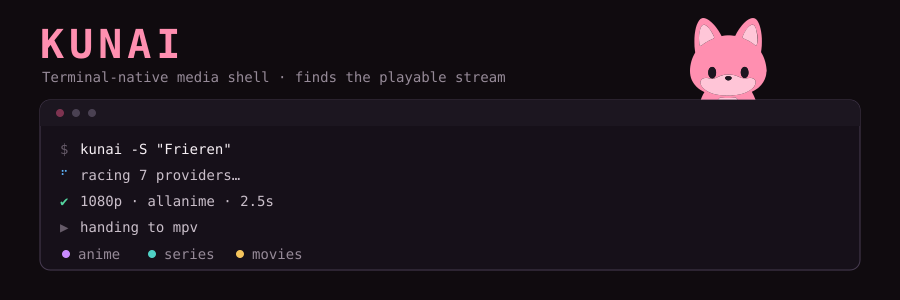
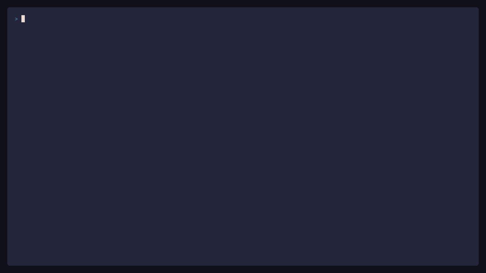

<div align="center">



**Search a title · pick a third-party source · watch in `mpv` · download for offline.**
One fullscreen, keyboard-driven terminal session.

[](https://www.npmjs.com/package/@kitsunekode/kunai)
&nbsp;
&nbsp;
&nbsp;
&nbsp;[](LICENSE)

Self-contained binary — no Bun or Node needed (mpv is still required for playback).

**Linux / macOS**

```bash
curl -fsSL https://kunai.kitsunekode.in/install.sh | bash
```

**Windows (PowerShell)**

```powershell
irm https://kunai.kitsunekode.in/install.ps1 | iex
```

Then:

```bash
kunai --setup && kunai -S "Dune"
```

</div>

---

## Table of Contents

- [Why Kunai](#why-kunai)
- [Showcase](#showcase)
- [Quick Start](#quick-start)
  - [Install Kunai](#install-kunai)
  - [Support matrix (0.3.0)](#support-matrix-030)
  - [Dependencies by platform](#dependencies-by-platform)
  - [Verify](#verify)
  - [What you need up front](#what-you-need-up-front)
- [Usage](#usage)
- [Key Bindings](#key-bindings)
- [Features](#features)
- [Dependencies — in detail](#dependencies--in-detail)
- [Configuration](#configuration)
- [Providers](#providers)
- [FAQ](#faq)
- [Uninstall](#uninstall)
- [Contributing and development](#contributing-and-development)
- [Appreciation](#appreciation)
- [Disclaimer](#disclaimer)

---

## Why Kunai

Kunai is a terminal-first client. You search a title, pick a third-party source, and it
hands a stream URL that provider already serves to `mpv` — no browser, no tabs, no ads, no mouse. One
fullscreen keyboard session covers anime, series, and movies, with offline
downloads, a release calendar, watch history, and Discord Rich Presence built in.

It takes the daily-driver confidence of tools like `ani-cli` and extends it into
an app-grade browsing experience that keeps search, details, episodes, and
playback connected — while staying a deterministic, scriptable CLI.

---

## Meet Kanna


A **kanna** (鉋) is a Japanese hand plane. You run it over rough wood and the
roughness leaves in one curl.

Kunai is the blade. Kanna is who holds it — twelve tabs, three dead mirrors and
a stream that stalls go in; the thing that plays comes out. She works nights,
hands it to `mpv`, and gets out of the frame.

She shows up on setup, on empty shelves, when a resolve fails, and on the way
out. On Kitty, Ghostty, iTerm2 and WezTerm you get the illustrated fox;
everywhere else she is a `🦊` and one short line, which is the same character
doing the same job. Redirected output gets neither.

`KUNAI_PET=off` retires her entirely — text included. `KUNAI_PET=glyph` keeps
her as the glyph. Full story in the
[Kanna guide](https://kunai.kitsunekode.in/docs/users/kanna).

---

## Showcase

The command palette (`/`) reaches every surface — here, the offline shell touring
help, diagnostics, and watch history without leaving the session:

<div align="center">



</div>

Every surface is reachable this way — search, details, the release calendar,
downloads, and Up Next — without leaving the session or touching a mouse.

---

## Quick Start

### Install Kunai

The recommended path downloads a **self-contained binary** with the Bun runtime
embedded — **no Bun or Node required**. It verifies a SHA256 checksum and records
how you installed so `kunai upgrade` / `kunai uninstall` do the right thing.

Binary install works on Linux, macOS, and Windows; the **bootstrap script differs
by OS** (`install.sh` vs `install.ps1`).

```bash
# Linux / macOS
curl -fsSL https://kunai.kitsunekode.in/install.sh | bash
```

```powershell
# Windows (PowerShell)
irm https://kunai.kitsunekode.in/install.ps1 | iex
```

> **Unsigned beta binaries** — Windows SmartScreen may warn on first run;
> `install.ps1` runs `Unblock-File` on the staged binary (or right-click →
> Properties → Unblock). macOS Gatekeeper may quarantine the binary; remove it
> with `xattr -dr com.apple.quarantine ~/.local/bin/kunai` (or your install
> path). Full detail:
> [Install and update](docs/users/install-and-update.mdx#unsigned-binaries-beta).

Inspect first (no dirs created), pin a version, or pick a channel:

```bash
curl -fsSL https://kunai.kitsunekode.in/install.sh | bash -s -- --dry-run
curl -fsSL https://kunai.kitsunekode.in/install.sh | bash -s -- --version 0.3.0
```

Keep it current with `kunai upgrade`; remove it with ownership-aware `kunai uninstall`
(add `--purge` to also delete config/history/cache).

> **Alternatives:** the npm channel needs **Node** (the published bin is a Node launcher
> that spawns a platform binary — you do not need Bun). `bun install -g` needs Bun.
> Source checkout is contributor-oriented:
>
> ```bash
> # npm or bun global
> npm install -g @kitsunekode/kunai      # or: bun install -g @kitsunekode/kunai
> # the installer can do this too: install.sh ... | bash -s -- --method npm
>
> # From source (contributors)
> git clone https://github.com/kitsunekode/kunai.git
> cd kunai && bun install && bun run link:global
> ```

### Support matrix (0.3.0)

| Target                                        | Status                              |
| --------------------------------------------- | ----------------------------------- |
| `linux-x64`, `linux-arm64` (glibc)            | **Supported**                       |
| `linux-x64-musl`, `linux-arm64-musl` (Alpine) | **Supported**                       |
| `darwin-x64`, `darwin-arm64`                  | **Beta**                            |
| `windows-x64`                                 | **Beta**                            |
| `windows-arm64`                               | **Experimental**                    |
| WSL                                           | Linux install + Linux mpv/PATH/data |
| FreeBSD / other BSD                           | **Unsupported** binary              |

Installer health: `kunai doctor` / `kunai doctor --json`. List PATH shadows with
`type -a kunai` / `which -a kunai` (bash), `whence -a kunai` (zsh), or
`Get-Command kunai -All` (Windows PowerShell).
See [docs/users/troubleshooting.mdx](docs/users/troubleshooting.mdx#installer-and-path-issues).

### Dependencies by platform

With the binary install, **mpv is the only required dependency**. The rest are
optional and auto-detected — install what you want, then run `kunai --setup` to
confirm.

<details>
<summary><b>Arch Linux</b></summary>

```bash
# Required
sudo pacman -S mpv
# Optional: downloads, poster previews, integrity checks
sudo pacman -S yt-dlp curl ffmpeg
```

</details>

<details>
<summary><b>Debian / Ubuntu</b></summary>

```bash
# Required
sudo apt install mpv
# Optional: downloads, poster previews, integrity checks
sudo apt install yt-dlp curl ffmpeg
```

</details>

<details>
<summary><b>macOS (Homebrew)</b></summary>

```bash
# Required
brew install mpv
# Optional: downloads, poster previews, integrity checks
brew install yt-dlp curl ffmpeg
```

</details>

<details>
<summary><b>Windows (winget)</b></summary>

```bash
# Required
winget install --id mpv-player.mpv-CI.MSVC -e
# Optional: downloads and post-download integrity checks
winget install yt-dlp Gyan.FFmpeg
```

> `ffprobe` ships inside the FFmpeg package on every platform.

</details>

<details>
<summary><b>Alpine / musl</b></summary>

```bash
apk add mpv yt-dlp ffmpeg
curl -fsSL https://kunai.kitsunekode.in/install.sh | bash
kunai --version
kunai --setup
```

</details>

<details>
<summary><b>WSL</b></summary>

WSL is a **Linux** environment — install Linux `kunai` + Linux `mpv` inside the distro.
Do not mix Windows-native `kunai.exe` / `mpv.exe` / `%APPDATA%` with WSL PATH or data.

```bash
# Inside WSL (Debian/Ubuntu example)
sudo apt install mpv yt-dlp ffmpeg
curl -fsSL https://kunai.kitsunekode.in/install.sh | bash
kunai --version
kunai --setup
```

</details>

### Verify

```bash
kunai --version
mpv --version
kunai --setup
kunai -S "Dune"
```

`-S` lands on search results — select a title, pick an episode when prompted, wait
for provider resolution, then confirm the committed `mpv` startup. If `mpv` is
missing, setup and browsing stay available; only playback handoff is blocked.
Inside the shell, `/` opens the command palette from anywhere.

### What you need up front

| Tool           | Required?            | Why                                                                                                  |
| -------------- | -------------------- | ---------------------------------------------------------------------------------------------------- |
| **Bun** ≥1.4.0 | bun/source           | Runtime for Bun-global and source installs. The default binary embeds it. The npm channel uses Node. |
| **mpv**        | Required             | Plays everything. `sudo pacman -S mpv` / `brew install mpv`                                          |
| **yt-dlp**     | Required for YouTube | YouTube playback and offline downloads. `sudo pacman -S yt-dlp` / `brew install yt-dlp`              |
| **ffprobe**    | Optional             | Post-download integrity checks (ships with FFmpeg)                                                   |
| **curl**       | Anime mode           | AniDB, the default anime provider, is behind Cloudflare. `sudo pacman -S curl`                       |
| **Discord**    | Optional             | Rich Presence via local Unix-socket / Windows named-pipe IPC                                         |

### Poster quality

Kunai picks the best renderer your terminal actually reports, asking it directly
at startup rather than guessing from `TERM`:

| Renderer            | Fidelity                     | Needs   | Terminals                                              |
| ------------------- | ---------------------------- | ------- | ------------------------------------------------------ |
| Kitty graphics      | true colour, full resolution | nothing | kitty, Ghostty                                         |
| iTerm2 inline image | true colour, full resolution | nothing | iTerm2, VS Code ≥1.80                                  |
| Sixel               | full resolution, 64 colours  | nothing | Windows Terminal ≥1.22, WezTerm, foot, xterm -ti vt340 |
| Half-block          | text approximation           | nothing | everywhere — the universal fallback                    |

**Nothing in that table needs installing.** Every renderer draws one image
prepared natively by `Bun.Image`, so chafa and ImageMagick were retired rather
than kept as optional upgrades.

Inline images outrank sixel where both exist: they carry the prepared PNG
verbatim, while sixel is quantised. Windows Terminal does not implement the Kitty
protocol, so sixel is the sharp path there.

Text renderers fit two pixels per character cell, which is roughly a hundredth
of the pixels sixel gives you — that difference is what "blocky posters" is.
Inside the persistent shell, sixel currently degrades to a text renderer: it
paints at the cursor and does not reflow, so it cannot be hosted in the Ink
layout yet. Force a specific path with `KUNAI_IMAGE_PROTOCOL=kitty|sixel|symbols|half-block`,
or disable posters with `KUNAI_POSTER=0`.

Setup and goodbye can show the illustrated fox companion on Kitty, Ghostty, iTerm2, and WezTerm.
Other terminals keep 🦊, and redirected output gets neither. `KUNAI_PET` takes `off` to retire her
entirely, or `glyph` to stay on 🦊 even where the picture would render.

If mpv is missing, Kunai won't start playback — setup and browsing remain available.
Everything else is optional and detected automatically — the setup wizard
(`/setup` or `kunai --setup`) walks through each capability and what it enables.

---

## Usage

### Launch commands

```bash
# Interactive: search, browse, discover
kunai

# Direct search
kunai -S "Dune"
kunai -S "Cowboy Bebop" --jump 1

# Anime mode
kunai -a -S "Attack on Titan"

# YouTube mode
kunai --youtube -S "lofi beats"

# Open a known TMDB id directly
kunai -i 438631 -t movie

# Resume where you left off
kunai --continue
kunai --history

# Discover and calendar
kunai --discover
kunai --calendar
kunai --random

# Offline and downloads
kunai --offline
kunai --download -S "Dune"
kunai --download -S "Dune" --download-path ~/Videos/Kunai

# Minimal chrome (zen mode)
kunai --zen --offline

# Setup wizard / verbose traces
kunai --setup
kunai --debug
```

Inside the shell, press `Tab` to cycle series -> anime -> YouTube. Use `/youtube`
or `/yt` to jump directly to YouTube mode; `/series` and `/anime` switch back.
YouTube search may work without `yt-dlp`, but playback and downloads will ask
you to install it instead of failing as a generic provider error.

### Inside the shell

Every screen has a context-sensitive footer showing the keys available right
there. Core shortcuts only (generated from the keybinding registry):

```text
/                 Command palette (from anywhere)
?                 Help overlay (full live chords)
Tab               Cycle catalog mode (series / anime / YouTube)
Enter             Open the highlighted title
Esc               Back · close panel · clear filter
⇧F                Switch provider (fallback) during playback
m                 Title control menu during playback
n / p             Next / previous episode
Ctrl+C            Quit
```

For the fuller stable set, see
[Commands and shortcuts](docs/users/commands-and-shortcuts.mdx)
or press `?` in the shell. Filters open with `/filters`, not a bare `Shift+F`.

---

## Key Bindings

Public shortcut docs are generated from the registry. Prefer the
[commands and shortcuts](docs/users/commands-and-shortcuts.mdx)
page or in-app `?` over duplicating chords here.

### Command palette (`/`)

| Command        | What it does                                                                           |
| -------------- | -------------------------------------------------------------------------------------- |
| `/search`      | Start a new search                                                                     |
| `/library`     | Browse completed offline titles                                                        |
| `/download`    | Queue the current episode for download                                                 |
| `/downloads`   | View active, queued, failed downloads                                                  |
| `/up-next`     | Current playback order (`/queue` is a compatibility alias)                             |
| `/discover`    | Personalized recommendations + trending                                                |
| `/calendar`    | Unified release calendar — anime · series · movies                                     |
| `/setup`       | Run the setup wizard                                                                   |
| `/settings`    | Configure provider, language, downloads, Discord (also Discord presence and analytics) |
| `/history`     | Watch history and resume                                                               |
| `/diagnostics` | Runtime snapshot and recent events                                                     |

---

## Features

### Search and discover

- **Search** a title by name. Anime, series, and YouTube modes use different provider sets (`Tab` cycles modes).
- **Stack filters** in one query: `mode:anime year:2026 rating:7 genre:isekai audio:ja subtitles:en` (`type:anime` is accepted as an alias).
- **Discover** personalized recommendations and trending titles.
- **Release calendar** is one content-kind–aware window across anime, series, and movies — filter by type (Tab) or day (←/→), with honest "airs today / releases / available" status. Provider resolution happens only after you open a row.
- **Random / Surprise** spins a non-autoplaying tray of cached recommendations.

### Playback

- Streams are resolved from direct-provider sources and handed to `mpv`.
- **Recover** (`Ctrl+R`) refreshes the current stream and resumes from last position.
- **Recompute sources** (`/recompute`) bypasses cached provider memory when provider state looks stale.
- **Fallback** (`⇧F`) tries the next compatible provider when the current one fails.
- **Source / quality picker** switches among already-resolved stream options.
- **Autoplay** automatically advances to the next episode in a series chain.
- **Post-playback** controls open from prefetched data first; recommendations warm in the background instead of delaying the menu.
- **Autoskip** skips intros, recaps, previews, and credits (powered by IntroDB/AniSkip when available).
- **Episode picker** jumps to any episode in the current season.
- **Subtitle management** picks your preferred language first; alternate tracks remain available in mpv.

### Offline downloads

Requires **yt-dlp** on your `PATH`. Without it, download features stay hidden and
everything else works normally.

- Queue downloads from any search result (`Ctrl+D`) or with `/download`. During playback, `d` opens diagnostics.
- Movies skip the episode picker — one key queues the download.
- The download queue persists across sessions (backed by SQLite).
- On restart, interrupted downloads are automatically resumed or retried.
- Optional post-download integrity checks (`ffprobe`). Offline artwork uses cached poster assets when available.
- Repairable sidecars: if the video is valid but subtitles/artwork need attention, retry repairs the sidecar without redownloading the whole video.
- Default download paths:
  - Linux: `~/.local/share/kunai/downloads`
  - macOS: `~/Library/Application Support/kunai/downloads`
  - Windows: `%LOCALAPPDATA%\kunai\downloads`

### Offline library

All completed downloads are grouped by title in the library panel (`/library`):

| Key       | Action                                                    |
| --------- | --------------------------------------------------------- |
| `↑↓`      | Navigate titles                                           |
| `Enter`   | Open episode browser (play, delete, protect, re-download) |
| `x`       | Delete title and all local files (with confirmation)      |
| `p`       | Toggle cleanup protection                                 |
| `1` / `2` | Switch between Library and Queue tabs                     |

### Discord Rich Presence

Enable via `/presence` or `/settings`. Kunai talks to Discord over **local IPC**
(Unix socket on Linux/macOS, named pipe on Windows) — there's no extra service or
`discord-rpc` package to install. The Discord desktop app must be running.
Kunai ships a default Discord application client id; override it in Settings or
`KUNAI_DISCORD_CLIENT_ID` only if you use your own Discord app. Presence is
**off** until you enable it. It shows what you're watching:

- **Watching Kunai** — Attack on Titan · Season 1, Episode 5 · provider
- A browsing state when you're searching between episodes
- Private mode hides title details

### Watch history

- Every playback session is recorded with position, progress, and completion status.
- Resume from where you left off with `kunai --continue` or `/history`.
- Individual entries can be removed, or the full history cleared.

### Diagnostics and recovery

- `/diagnostics` shows current runtime state, recent events, and capability status.
- Support bundles include provider resolve, source cache, post-playback timing, and repairable download summaries.
- `kunai --debug` for verbose traces during troubleshooting.
- `/export-diagnostics` generates a redacted JSON snapshot for issue reports.
- `/report-issue` opens GitHub issue triage guidance.
- Usage analytics (`/analytics`) sends nothing until you consent. Setup
  recommends it and pre-selects it on the consent slide, but only a keypress
  there enables it — skipping, accepting all defaults, or any non-interactive
  run leaves it exactly as it was. Declining is one keypress, and
  **Settings → General → Usage analytics** flips it either way later; turning it
  off deletes the install id. When enabled, the ping is
  `{ installId, version, os, arch, ts }`
  only — never titles, queries, providers, URLs, or paths. `installId` on the
  wire is a `sha256` of a local random id; the id itself never leaves your
  machine, and you can rotate it any time from Settings. Preview with
  `/analytics show`.
  Honour `DO_NOT_TRACK=1` / `CI=true` as hard blocks on send and enable.
  Your IP address is never read — the ingest has no code path that reads a
  client address, so there is nothing to log or rate-limit on.
  The ingest stores HMAC-hashed ids for daily/lifetime aggregates only; public
  docs may show yesterday’s opt-in actives and an exact lifetime total.
- Kunai checks for a newer published version on startup and notifies you in-shell — updating is a quick reinstall (see [Uninstall](#uninstall) / [Quick Start](#quick-start)).

---

## Dependencies — in detail

### Required

| Dependency        | Purpose        | Install                                     |
| ----------------- | -------------- | ------------------------------------------- |
| **Bun** `>=1.4.0` | Runtime        | `curl -fsSL https://bun.sh/install \| bash` |
| **mpv**           | Video playback | `sudo pacman -S mpv` / `brew install mpv`   |

### Optional — what each enables

| Tool                | What it gives you                                                                                        | Without it                                                                           |
| ------------------- | -------------------------------------------------------------------------------------------------------- | ------------------------------------------------------------------------------------ |
| **yt-dlp**          | YouTube playback and download queue. Required for YouTube mode play/resolve and `/download`.             | YouTube search may work via Invidious/Piped, but playback and downloads need yt-dlp. |
| **ffprobe**         | Post-download integrity check. Verifies the file is playable. (Ships with FFmpeg.)                       | Downloads still work; integrity check is skipped.                                    |
| **Discord desktop** | Rich Presence via local Unix-socket / named-pipe IPC. Needs a Discord application client id in Settings. | No Discord integration.                                                              |
| **Kitty / Ghostty** | Native poster protocol. Best-quality image rendering.                                                    | iTerm2 inline images, sixel, or half-block — all built in.                           |

### Poster previews by terminal

| Terminal               | Protocol             | How                          |
| ---------------------- | -------------------- | ---------------------------- |
| Kitty                  | Native               | Best quality, no extra tools |
| Ghostty                | Kitty-compatible     | Same as Kitty                |
| WezTerm                | Built-in Sixel       | No external renderer         |
| Windows Terminal 1.22+ | Built-in Sixel       | No external renderer         |
| Everything else        | Half-block (default) | Built in; nothing to install |
| Non-TTY / unsupported  | None                 | No posters                   |

Environment overrides:

```bash
KUNAI_POSTER=0                          # Disable posters
KUNAI_PET=off                           # Retire the fox companion entirely
KUNAI_PET=glyph                         # Keep the companion, but only as 🦊
KUNAI_IMAGE_PROTOCOL=kitty              # Force protocol
KUNAI_IMAGE_SIZE=30x18                  # Custom dimensions
KUNAI_IMAGE_DEBUG=1                     # Verbose poster logging
```

---

## Configuration

### Setup wizard

Run `/setup` or `kunai --setup` for a guided walkthrough (seven slides):

1. Dependencies — mpv, yt-dlp, ffmpeg, curl-impersonate, and the poster
   renderer, each with the install command for _this_ machine
2. What you watch — shows, anime, or YouTube
3. Language — preferred audio and subtitles, applied to every lane
4. Playback — autoplay, skip intros, skip credits
5. Downloads & accounts — queue quality, AniList, TMDB, Discord presence
6. Usage ping — recommended and pre-selected, one keypress to decline
7. Ready — what was chosen, and anything still outstanding

Every control starts from what you already have configured, so rerunning setup
shows your settings rather than factory defaults and can never quietly undo
them. `s` takes the current slide's recommendation, `S` takes every remaining
one, and `esc` leaves — asking first once you have answered something.

The usage ping is the one exception to `S`: accept-all never turns it on, and
nothing but a keypress on that slide can. Change it any time in
**Settings → General → Usage analytics**; turning it off deletes the install id.

Download location and finer preferences live in the [settings panel](#settings-panel).

### Settings panel

`/settings` (or `kunai` then `/settings`) — all configurable from inside the shell:

- Default provider (anime and series)
- Language profiles (audio, subtitle per content type)
- Download preferences (enable, auto-download mode, cleanup policy, path)
- Discord Presence (provider, privacy, client ID)
- Skip behavior (recap, intro, preview, credits)
- Display preferences (posters, memory usage, footer hints)

### Config files

| Path                             | What it holds              |
| -------------------------------- | -------------------------- |
| `~/.config/kunai/config.json`    | Human-readable user config |
| `~/.config/kunai/providers.json` | Provider overrides         |

Both are editable directly, but the setup wizard and settings panel are the
recommended interface.

---

## Providers

Kunai can talk to these third-party adapters; they are unaffiliated, may break
or disappear, and Kunai does not host what they serve.

- **videasy**, **rivestream**, **vidlink** — series and movies (Videasy first)
- **anidb** — automatic anime lane; **allmanga** and **miruro** stay registered and are manually selectable
- **youtube** — YouTube mode (Invidious search + yt-dlp)

Availability varies by title, region, subtitle track, and source mirror. Some
streams are hard-sub only or expose incomplete subtitle metadata. The recovery
paths are intentional: retry (`r`), source switch (`o` / `k`), provider fallback
(`⇧F`), and diagnostics export.

Legacy Playwright provider code is archived under `.archive/legacy/` as reference.
Experimental provider research lives in `.reference/experiments/scratchpads/` and does
not ship as runtime behavior.

---

## FAQ

<details>
<summary><b>Search works but playback fails or stalls.</b></summary>

Providers break when upstream sites change. In playback, press `Ctrl+R` to recover the
stream, `⇧F` to fall back to the next compatible provider, `o` to pick another
source, or `k` to pick quality. If sources look stale, `/recompute` bypasses cached provider
memory. Persistent issues → `/diagnostics`, then `/export-diagnostics` for a
redacted snapshot to attach to a bug report.

</details>

<details>
<summary><b>"No results found" for a title I know exists.</b></summary>

Try the other mode — series, anime, and YouTube use different provider sets (`Tab`
cycles modes, `/anime` and `/series` jump directly, or launch with `-a`). Some
titles are only indexed under an alternate name.

</details>

<details>
<summary><b>Kunai won't start playback.</b></summary>

mpv isn't installed or isn't on your `PATH`. Install it (see
[Dependencies by platform](#dependencies-by-platform)) and re-run.

</details>

<details>
<summary><b>I don't see download options.</b></summary>

Install **yt-dlp** and restart. Download features are hidden when yt-dlp is
missing; everything else keeps working.

</details>

<details>
<summary><b>No poster previews.</b></summary>

Kitty and Ghostty render natively, iTerm2 and VS Code ≥1.80 use inline images,
sixel terminals use sixel, and everything else falls back to built-in
**half-block**. Nothing needs installing. Check `/diagnostics` for the detected
renderer, or set `KUNAI_IMAGE_DEBUG=1` for verbose logging. Inside tmux or screen
Kunai stays on half-block, because it emits no passthrough wrapper.

</details>

<details>
<summary><b>How do I update?</b></summary>

Keep it current with `kunai upgrade` (channel-aware). Kunai also notifies you
in-shell when a newer version is published. Package-manager reinstall and source
`git pull && bun run relink:global` remain secondary paths.

</details>

<details>
<summary><b>`kunai` missing, shadowed, or install ownership wrong?</b></summary>

Run `kunai doctor` (or `kunai doctor --json`). List every binary with
`type -a` / `which -a` (bash), `whence -a` (zsh), or `Get-Command kunai -All`
(PowerShell). Rollback with `kunai rollback --list` / `kunai rollback`. Uninstall
only via the owning channel (`kunai uninstall`, or `npm uninstall -g` for npm).
Checksums/404s → `kunai install --force` / pin a version or re-verify
`SHA256SUMS`.

</details>

<details>
<summary><b>Windows SmartScreen or macOS Gatekeeper blocks the binary?</b></summary>

Release binaries are unsigned during beta. On Windows, `install.ps1` runs
`Unblock-File`; you can also right-click → Properties → Unblock. On macOS:
`xattr -dr com.apple.quarantine ~/.local/bin/kunai` (or your install path).
See [Install Kunai](#install-kunai) and
[Install and update](docs/users/install-and-update.mdx#unsigned-binaries-beta).

</details>

<details>
<summary><b>YouTube age-restricted / members content?</b></summary>

Set `youtubeMetadata.cookiesFromBrowser` or an absolute `cookiesFile` in
`config.json`. Never paste cookie contents into issues; review redacted
`/export-diagnostics` bundles first. Kunai does not bypass DRM.

</details>

---

## Uninstall

`kunai uninstall` is channel-aware — it removes the binary, runs the matching
`npm`/`bun` uninstall, or prints source-checkout steps, based on how you
installed. It keeps your data by default.

```bash
kunai uninstall            # remove kunai, keep config/history/cache
kunai uninstall --purge    # also delete config, data, and cache
```

Manual fallback if `kunai` isn't on PATH:

```bash
# npm / bun global
npm uninstall -g @kitsunekode/kunai   # or: bun uninstall -g @kitsunekode/kunai

# Source install
bun run unlink:global   # from the repo, or: bun unlink

# Binary install
rm -f ~/.local/bin/kunai
```

User data locations (removed by `--purge`): Linux `~/.config/kunai`,
`~/.local/share/kunai`, `~/.cache/kunai`; macOS `~/Library/Application Support/kunai`
and `~/Library/Caches/kunai`; Windows `%APPDATA%\kunai` and `%LOCALAPPDATA%\kunai`.

---

## Contributing and development

Contributions are welcome — bug fixes, provider parity, platform testing, and test
coverage all help. Provider fixes with `/diagnostics` output and macOS/Windows
parity notes are the highest-value areas, because they are the hardest to catch
without more machines than we have.

Kunai is a Bun monorepo: the CLI, provider adapters, storage, and the shared relay
each live in their own package. Running from source, the deterministic check
suite, changesets, and the release gate are all in
[CONTRIBUTING.md](CONTRIBUTING.md). Design docs live in
[.docs/architecture.md](.docs/architecture.md).

---

## Appreciation

Kunai stands on the shoulders of the tools that did this first, and does not
work without most of them:

- [**ani-cli**](https://github.com/pystardust/ani-cli) — proved that fast,
  shell-native playback can be joyful. The AllAnime decoder in
  `packages/providers/src/allmanga` is checked for parity against it.
- [**mpv**](https://mpv.io) — the player. Kunai finds a stream and gets out of
  the way; everything you actually watch, you watch in mpv.
- [**yt-dlp**](https://github.com/yt-dlp/yt-dlp) — extraction and offline
  downloads.
- [**AniSkip**](https://aniskip.com) — the community skip-times database behind
  auto-skip. Every intro and outro Kunai skips was timed by someone there.
- [**VLC**](https://www.videolan.org/vlc/) — for two decades of proving a media
  player can be free, universal, and answer to nobody.

The goal is not to clone them, but to bring that same daily-driver confidence
into a deterministic CLI workflow.

---

## Disclaimer

Kunai is a client-side playback tool. It does not host, upload, mirror, seed, or
distribute video content. Streams and related assets are served by non-affiliated
third-party providers. Use responsibly and in accordance with applicable laws and
service terms.
