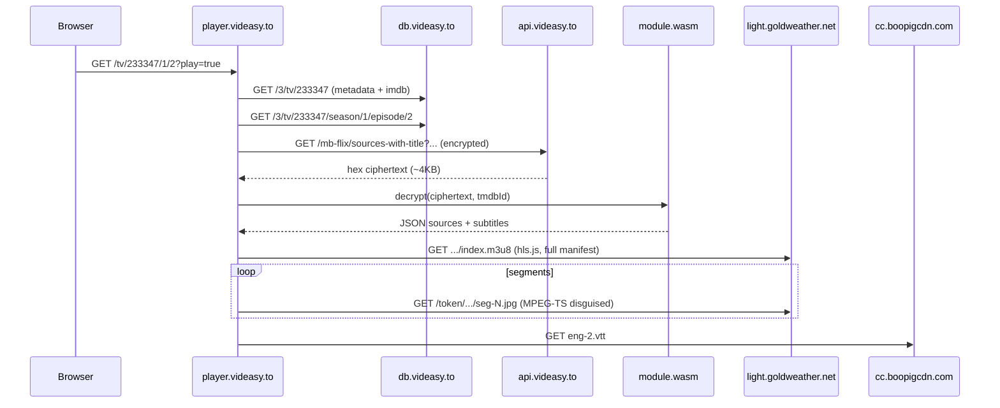

# player.videasy.to parity report — Study Group `tmdb=233347` S01E02

Probe target: `https://player.videasy.to/tv/233347/1/2?play=true`

Artifacts: `captures/videasy-player-probe-summary.json` (Playwright network capture)

## How the website player works (observed)



### Network facts (Playwright + manual DevTools)

| Step              | Host                                              | Notes                                                |
| ----------------- | ------------------------------------------------- | ---------------------------------------------------- |
| Metadata          | `db.videasy.to`                                   | Title, season, episode, `imdb_id` for query          |
| Source API        | `api.videasy.to/mb-flix/sources-with-title`       | Same route Kunai prefers for Neon                    |
| Referer on API    | `https://player.videasy.to/`                      | **No** `x-app-id` / `x-session-token` on this path   |
| WASM              | `player.videasy.to/module.wasm`                   | Same decrypt stack as Kunai (`module1_patched.wasm`) |
| HLS manifest      | `light.goldweather.net/.../aW5kZXgubTN1OA==.m3u8` | ~293KB VOD playlist, 686 segments                    |
| Segments          | `light.goldweather.net/{token}/c2Vn-...jpg`       | MPEG-TS (`0x47` sync), fake `.jpg/.html` extensions  |
| Subtitles         | `cc.boopigcdn.com/.../eng-2.vtt`                  | From decrypted API payload                           |
| Player UI servers | NEON, SKYE, BREACH, …                             | Valorant codenames in Next.js bundle                 |

### API query shape (web)

```
GET https://api.videasy.to/mb-flix/sources-with-title
  ?title=Study%20Group
  &mediaType=tv
  &year=2025
  &episodeId=2
  &seasonId=1
  &tmdbId=233347
  &imdbId=tt35304338
Referer: https://player.videasy.to/
```

Kunai already supports `seasonId`, `episodeId`, `imdbId`, `year` when title metadata provides them.

## Why web plays but Kunai mpv hung

| Layer        | Website                                       | Kunai CLI (before fix)                                                    |
| ------------ | --------------------------------------------- | ------------------------------------------------------------------------- |
| Resolve      | WASM decrypt + mb-flix API                    | Same WASM + API (parity OK)                                               |
| Manifest     | hls.js reads **full** ~293KB playlist         | FFmpeg HLS demuxer reads **128KB** over HTTP                              |
| Segment URLs | Host-root `/token/seg.jpg` resolved correctly | Truncated parse → bogus URLs (`…/solarstraysociety.com/…`) → **404 loop** |
| Player       | hls.js + MSE                                  | mpv + libavformat                                                         |
| ytdl hook    | N/A                                           | mpv `ytdl_hook` could interfere with local/remote m3u8                    |

**Referer is not the blocker** for Study Group: segments return HTTP 200 with `player.videasy.to`, `cineplay.to`, or `player.videasy.to/` referer.

### Fix landed in Kunai

`apps/cli/src/infra/player/hls-manifest-materializer.ts`:

1. Fetch full manifest with stream headers
2. Absolutize host-root segment paths to `https://light.goldweather.net/...`
3. Write local `playlist.m3u8` for mpv
4. `--ytdl=no` on HLS URLs in `buildMpvArgs`

After materialization: **0 segment 404s** in mpv probe (vs 100% 404 before).

## What Kunai is missing vs web player

### P0 — playback correctness (addressed or in flight)

- [x] mb-flix before `e3b0c442` for Neon (`resolveVideasyRequestServers`)
- [x] HLS manifest materialization for goldweather-style CDNs
- [x] `--ytdl=no` for `.m3u8`
- [ ] Purge stale cache after route/referer changes
- [ ] Segment-level resolve-gate probe (manifest-only probe passes while mpv fails)

### P1 — client profile parity

Web embed `player.videasy.to` uses a **third client profile** Kunai does not model explicitly:

| Profile            | app id            | API referer          | Stream referer                   |
| ------------------ | ----------------- | -------------------- | -------------------------------- |
| Cineplay embed     | `bc-frontend`     | `cineplay.to`        | per-episode `cineplay.to/tv/...` |
| Vidking embed      | `vidking`         | `vidking.net`        | `vidking.net`                    |
| **Videasy player** | unknown / default | `player.videasy.to/` | `player.videasy.to/tv/...`       |

**Action:** add `videasyAppId: "videasy-player"` (or detect from settings) mapping to `player.videasy.to` origin/referer. API payloads are equivalent for Study Group; stream referer should match the embed the CDN expects when tokens are tied to origin.

### P1 — metadata-enriched resolve

Web always fetches `db.videasy.to` first for `imdbId` + `year`. Kunai should:

- Pull `imdbId` from TMDB `external_ids` when missing on `TitleIdentity`
- Set `year` from `first_air_date` for series queries
- Prefer `db.videasy.to` (`.to` TLD matches current web; legacy code referenced `.net`)

### P2 — browser parity layer (optional, not default hot path)

Playwright probe (`videasy-player-probe.ts`) did **not** reach `<video>` in headless mode (likely autoplay/gesture/bot friction). Use as **research tool**, not production resolve.

Tier-2 embed scrape in `direct.ts` (`buildEmbedReferer`) should add:

```text
https://player.videasy.to/tv/{tmdb}/{season}/{episode}?play=true
```

as fallback referer tier when API is blocked — parity with existing cineplay/vidking embed tiers.

### P2 — UX / naming

- Rename Luffy → **Neon**, map server codenames to web Valorant names in source picker
- Show resolve evidence: `mb-flix`, CDN host, quality count (detect single-ORG stale cache)

### P3 — efficiency

| Web                                                  | Kunai opportunity                                                                               |
| ---------------------------------------------------- | ----------------------------------------------------------------------------------------------- |
| Single page bootstraps metadata + source in parallel | Prefetch `db.videasy.to` episode + external_ids during episode pick                             |
| hls.js incremental segment load                      | mpv VOD playlist is large — materializer + optional shorter manifest if API exposes variant URL |
| No session token on player.videasy.to                | Don't require Cineplay session token when using videasy-player profile                          |
| Server picker in UI                                  | Per-title server preference cache after first success                                           |

## Playwright probe usage

```sh
cd apps/experiments
bun scratchpads/provider-videasy-player/videasy-player-probe.ts
# optional headed run if you have a display:
bun scratchpads/provider-videasy-player/videasy-player-probe.ts --headed
```

Outputs `captures/videasy-player-probe-summary.json`.

Headless automation may stop before HLS segment traffic; use DevTools or headed probe for full segment capture. API + WASM path is still captured reliably.

## Recommended implementation order

1. **Ship HLS manifest materializer** (mpv fix) — highest impact
2. **Add `videasy-player` client profile** + settings option for users on `player.videasy.to` / `videasy.to`
3. **Enrich resolve query** with TMDB `imdbId` + `year` from `db.videasy.to`
4. **Segment probe** in `stream-reachability` using host-root URL resolution
5. **Embed referer tier** for `player.videasy.to` API fallback
6. **Source picker naming** + diagnostics (route, host, quality ladder)

## Verification checklist

```sh
# API parity
cd apps/experiments && bun scratchpads/provider-cineplay/light-probe.ts --decrypt 233347 1 2

# Kunai resolve
bun -e "import { resolveVideasyDirect } from './packages/providers/src/videasy/direct.ts'; ..."

# mpv with materializer (after CLI fix)
# purge episode cache → play S01E02 → should reach Playing < 30s
```

Expected: **3 qualities (360/720/1080)**, subtitle on `cc.boopigcdn.com`, CDN `light.goldweather.net`, no mpv segment 404s.
